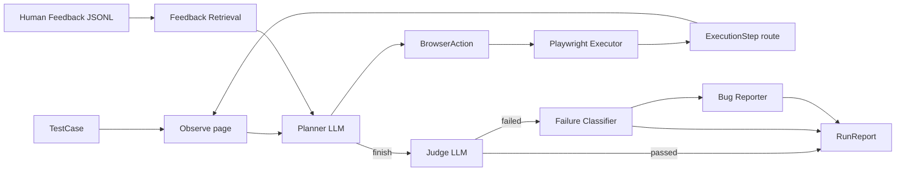

# UiBrowserAgent

Pet-проект AI-agent для автоматизированного UI-тестирования web-сайтов через
браузер.

Этот репозиторий одновременно является рабочим прототипом и архивом обучения.
Проект собирался по шагам, чтобы изучить, как проектируются агентские системы:
типизированные контракты, состояние, граф управления, выполнение инструментов,
оценка качества, наблюдаемость, persistence и память на основе человеческой
обратной связи.

Текущая система принимает `TestCase`, открывает страницу через Playwright,
наблюдает текущее состояние страницы, просит LLM Planner выбрать следующее
браузерное действие, выполняет его через детерминированный browser adapter,
записывает маршрут, проверяет результат независимым Judge, классифицирует сбои и
формирует структурированный отчет о запуске.

## Статус Проекта

Статус: `v0.1 educational demo completed`.

Уже реализовано:

- browser testing agent на LangGraph;
- Pydantic-контракты для всех важных данных между компонентами;
- LangChain structured output для Planner, Judge, Classifier и Reporter;
- Playwright adapter для действий в настоящем браузере;
- детерминированный execution trace со скриншотами;
- ограничение цикла через `max_steps` и `max_failures`;
- независимый Judge вместо доверия к `finish` от Planner;
- классификация failed run;
- генерация структурированного bug report;
- JSON и Markdown run reports;
- append-only run history в JSONL;
- human feedback records в JSONL;
- deterministic feedback retrieval и planner memory context;
- LangSmith traces и evaluation experiments;
- component и end-to-end тесты;
- архив уроков;
- проектная документация;
- Notion-friendly база знаний для будущих проектов.

Что намеренно не завершено на этом этапе:

- production web UI/API;
- интеграция с реальным bug tracker;
- генерация Playwright автотестов из маршрутов агента;
- semantic/vector RAG;
- поддержка vision model;
- production deployment и multi-user security.

Это не "дыры" текущего этапа, а логичные темы следующей стадии развития.

## Зачем Нужен Этот Проект

Цель проекта - не просто вызвать LLM из Python. Цель - научиться строить
агентскую систему, которую можно тестировать, отлаживать, измерять и улучшать.

Главная инженерная идея:

```text
LLM предлагает намерение.
Типизированные контракты валидируют его.
Детерминированные tools выполняют его.
Граф ограничивает поток управления.
Judge проверяет результат.
Persistence объясняет запуск после выполнения.
Evaluation измеряет качество.
Human feedback улучшает будущие запуски.
```

Это ключевой навык AI engineering: превращать вероятностное поведение модели в
контролируемую программную систему.

## Общий Поток Работы



## Структура Репозитория

```text
src/browser_agent/
├── domain/                # Pydantic domain contracts
├── evaluation/            # planner, judge и end-to-end evaluation helpers
├── state.py               # LangGraph AgentState
├── graph.py               # основной LangGraph workflow
├── runner.py              # composition layer для реальных запусков
├── planner.py             # LLM Planner следующего действия
├── observer.py            # node получения page snapshot
├── executor.py            # deterministic action execution node
├── browser.py             # Playwright browser adapter
├── judge.py               # независимая проверка результата
├── classifier.py          # классификация failed run
├── reporter.py            # генерация structured bug report
├── reporting.py           # сохранение JSON/Markdown RunReport
├── run_history.py         # append-only run history
├── feedback.py            # human feedback records и JSONL store
├── feedback_cli.py        # CLI для добавления feedback
├── feedback_retrieval.py  # deterministic feedback retrieval
├── approval.py            # LangGraph interrupt/resume approval
├── approval_policy.py     # deterministic action risk policy
├── persistence.py         # checkpoint/thread config helpers
└── observability.py       # LangSmith trace config
```

Другие важные папки:

```text
scripts/        # demo-запуски, evaluation и upload dataset scripts
tests/          # regression tests агентской системы
examples/       # воспроизводимые demo fixtures и feedback examples
learning/       # архив уроков: теория, задания и выполненные упражнения
docs/           # проектная документация и архитектурные заметки
notion_export/  # переносимая база знаний по AI agents для будущих проектов
artifacts/      # локальные runtime outputs; не коммитить
```

## Установка

Нужен Python 3.11+.

```powershell
python -m pip install -e ".[dev]"
playwright install chromium
```

Создай `.env` на основе [.env.example](.env.example):

```text
OLLAMA_MODEL=qwen3.5:35b
LANGSMITH_TRACING=true
LANGSMITH_API_KEY=replace-with-your-langsmith-key
LANGSMITH_PROJECT=ui-browser-agent-dev
```

Модель Ollama можно менять. Для этого проекта важнее не "креативность", а
стабильное следование инструкциям и надежный structured output.

## Запуск Тестов

```powershell
python -m pytest -q
```

Тесты покрывают:

- валидацию domain models;
- prompt и structured output Planner;
- routing внутри graph;
- execution trace;
- Judge;
- failure classification;
- bug reporting;
- approval flow;
- persistence;
- run history;
- feedback memory;
- deterministic evaluation helpers;
- runner integration.

## Запуск Агента С Видимым Браузером

```powershell
python scripts\run_real_agent.py
```

Этот script:

- открывает `examples/playwright_fixture.html`;
- запускает видимый Chromium;
- выполняет LangGraph agent;
- печатает state graph по шагам;
- сохраняет screenshots и reports в `artifacts/`;
- пишет run history в `artifacts/run-history/runs.jsonl`;
- печатает checkpoint state в конце.

Запуск с committed feedback-memory примером:

```powershell
python scripts\run_real_agent.py --feedback-path examples\feedback\first-real-agent.feedback.jsonl
```

## Добавление Human Feedback

Feedback хранится в JSONL. Это не "магическое обучение модели". Это явное
человеческое знание, которое можно извлечь и добавить в будущий planner prompt.

Пример:

```powershell
python scripts\add_feedback.py `
  --run-id "manual-seed" `
  --test-case-id first-real-agent `
  --scope planner `
  --summary "Planner should use a stable locator for the task input." `
  --correction 'For the task input, prefer label=Task.' `
  --tags planner,locator
```

Локальный feedback по умолчанию пишется в:

```text
artifacts/feedback/feedback.jsonl
```

Воспроизводимые примеры должны лежать в:

```text
examples/feedback/
```

## Запуск С Human Approval

```powershell
python scripts\run_agent_with_approval.py
```

Этот пример показывает LangGraph interrupt/resume:

1. Planner предлагает browser action.
2. Deterministic policy решает, нужно ли подтверждение.
3. Graph ставится на паузу через interrupt payload.
4. Человек подтверждает или отклоняет действие.
5. Graph возобновляется из checkpoint.

## Evaluation Команды

Локальная component evaluation:

```powershell
python scripts\evaluate_planner.py
python scripts\evaluate_judge.py
python scripts\evaluate_end_to_end.py
```

Live browser end-to-end evaluation:

```powershell
python scripts\evaluate_live_end_to_end.py --repeat 3 --slow-mo 100
```

LangSmith experiments:

```powershell
python scripts\run_planner_experiment.py
python scripts\run_judge_experiment.py
```

Dataset upload helpers:

```powershell
python scripts\upload_planner_dataset.py
python scripts\upload_judge_dataset.py
```

## Документация

Начинать лучше отсюда:

- [docs/README.md](docs/README.md) - индекс документации.
- [docs/architecture.md](docs/architecture.md) - текущая архитектура.
- [docs/langgraph-agent-flow.md](docs/langgraph-agent-flow.md) - подробный flow графа.
- [docs/concepts-and-decisions.md](docs/concepts-and-decisions.md) - концепции и инженерные решения.
- [docs/memory-feedback-retrieval.md](docs/memory-feedback-retrieval.md) - persistence, memory и retrieval.
- [docs/evaluation-observability.md](docs/evaluation-observability.md) - testing, evaluation и LangSmith.
- [docs/runbook.md](docs/runbook.md) - практический справочник команд.
- [docs/code-review.md](docs/code-review.md) - senior review и идеи улучшений.
- [docs/future-study-roadmap.md](docs/future-study-roadmap.md) - следующие темы изучения.

Архив обучения:

- [learning/README.md](learning/README.md) - уроки, по которым строилась система.

Переносимые заметки для будущих проектов:

- [notion_export/00_index.md](notion_export/00_index.md) - Notion-friendly knowledge base.

## Главные Архитектурные Уроки

### 1. Не Давать LLM Выполнять Side Effects

LLM возвращает типизированный `BrowserAction`. Executor - обычный Python-код,
который решает, как вызвать Playwright. Так поведение можно тестировать,
логировать и отлаживать.

### 2. Контракты Важнее Prompt

Самые важные файлы - не prompts. Самые важные файлы - контракты данных в
`src/browser_agent/domain/models.py`. Prompt становится безопаснее, когда модель
обязана вернуть объект строгой схемы.

### 3. Разделять Planner И Judge

Planner выбирает следующее действие. Judge независимо проверяет, выполнены ли
ожидаемые результаты. `finish` от Planner не считается доказательством успеха.

### 4. Считать Memory Данными

Human feedback хранится как структурированные записи, извлекается
детерминированно и форматируется в planner prompt. Это сопровождаемее, чем
бесконечно править один большой prompt после каждой ошибки.

### 5. Оценивать Компоненты Отдельно

Ошибки агента проще отлаживать, когда Planner, Judge, retrieval и complete run
можно измерить отдельно.

## Текущие Ограничения

- Основной demo-сценарий основан на локальном Playwright fixture.
- Наблюдение страницы использует accessibility snapshot, а не анализ screenshots
  через vision model.
- Feedback retrieval сейчас deterministic keyword/metadata style, а не vector
  RAG.
- Генерация Playwright tests из route пока не реализована.
- Approval показан через отдельный script, но не встроен в default `run_agent()`
  helper.
- Storage основан на JSONL/files. Это удобно для обучения, но недостаточно для
  production multi-user service.

## Рекомендуемые Следующие Улучшения

Самые полезные следующие шаги:

1. Генерировать Playwright test drafts из успешных route.
2. Добавить route normalization перед code generation.
3. Добавить semantic или hybrid retrieval по feedback и успешным маршрутам.
4. Сохранять `used_memory_ids` в reports.
5. Добавить больше live end-to-end scenarios.
6. Добавить prompt versioning.
7. Заменить JSONL persistence на database-backed adapters.
8. Сделать небольшой review UI для route, screenshots, verdict и feedback.

## Заметка Ментора

Этот проект полезен тем, что показывает разницу между "LLM demo" и "agentic
software system".

Когда будешь переносить эти идеи в новый проект, начинай с вопросов:

1. Какой типизированный вход?
2. Какое состояние у одного запуска?
3. Какие решения действительно требуют LLM?
4. Какие действия должны быть deterministic tools?
5. Кто проверяет результат?
6. Что сохраняется для отладки?
7. Как будет измеряться качество?
8. Как человеческие исправления будут улучшать будущие запуски?

Если ты можешь ответить на эти вопросы до кода, ты проектируешь агента как
инженер, а не надеешься, что один большой prompt удержит всю систему.
