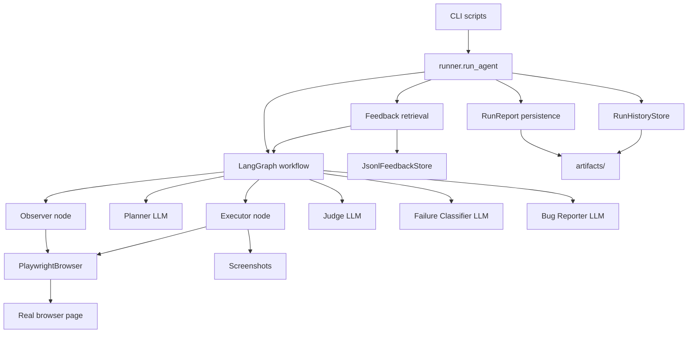
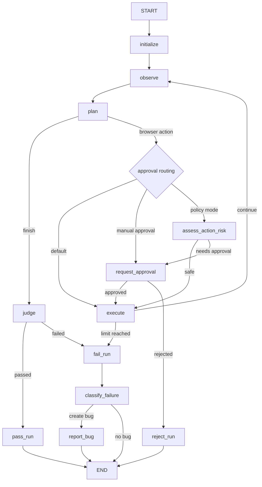

# Architecture

This document describes the current `UiBrowserAgent` architecture as implemented
in `src/browser_agent`.

The project is an educational but structurally realistic AI-agent system for
browser UI testing. It is designed to show how an LLM can participate in a
controlled software workflow without becoming the whole system.

## Executive Summary

`UiBrowserAgent` takes a typed `TestCase` and runs it against a browser page.

The agent:

1. Opens the start URL.
2. Observes the current page through a Playwright accessibility snapshot.
3. Uses an LLM Planner to choose exactly one next `BrowserAction`.
4. Executes the action through a deterministic Playwright adapter.
5. Records the action result as an `ExecutionStep`.
6. Loops until the Planner proposes `finish`, a limit is reached or a failure
   condition stops the run.
7. Uses an independent LLM Judge to verify expected results.
8. Classifies failed runs.
9. Optionally creates a structured bug report.
10. Saves a run report, run history and artifacts.
11. Retrieves relevant human feedback for future Planner decisions.

The important architectural boundary:

```text
LLM decides intent. Python executes and verifies boundaries.
```

The LLM never directly controls Playwright. It emits typed data. The system
validates, routes, executes, persists and evaluates that data.

## System Diagram



## Layered Structure

The code is organized around responsibility, not around lesson order.

```text
Domain contracts
  -> Agent state
  -> LLM roles
  -> Browser tools
  -> LangGraph workflow
  -> Runner composition
  -> Persistence and memory
  -> Evaluation and observability
  -> CLI scripts
```

### 1. Domain Contracts

Location:

```text
src/browser_agent/domain/models.py
```

The domain layer defines the stable language of the system:

- `TestCase` - input scenario;
- `BrowserTarget` - typed browser locator;
- `BrowserAction` - one proposed action;
- `ActionResult` - deterministic execution result;
- `ExecutionStep` - one observe-plan-execute record;
- `JudgeVerdict` - independent result check;
- `RunTermination` - why the graph stopped;
- `FailureClassification` - interpretation of a failed run;
- `BugReport` - structured product bug draft;
- `RunReport` - stable final run artifact;
- `ActionApproval` - human approval decision;
- `ApprovalPolicyDecision` - deterministic risk policy result.

This layer intentionally has no LangChain, LangGraph, Playwright, file system or
LangSmith dependencies.

Why this matters:

- contracts make LLM outputs testable;
- contracts make persistence stable;
- contracts reduce prompt ambiguity;
- contracts allow adapters to change without rewriting business logic.

### 2. Agent State

Location:

```text
src/browser_agent/state.py
```

`AgentState` is the working memory of one graph run. It contains:

```text
test_case
current_url
route
step_count
failure_count
status
page_snapshot
proposed_action
last_result
verdict
termination
classification
bug_report
action_approval
approval_policy_decision
memory_context
```

LangGraph nodes return partial state updates:

```python
return {"proposed_action": action}
```

Nodes should avoid mutating lists in place. For example:

```python
return {"route": [*state["route"], step]}
```

This keeps node behavior easier to test and safer for checkpointing.

### 3. LLM Roles

LLM-backed components are split by responsibility:

```text
planner.py     -> choose the next BrowserAction
judge.py       -> verify expected results
classifier.py  -> classify a failed run
reporter.py    -> draft a structured BugReport
```

Each role has:

- its own prompt;
- its own Pydantic output schema;
- its own tests;
- its own evaluation path where useful.

Why separate roles:

- Planner optimization should not affect Judge behavior accidentally;
- Judge can challenge a premature Planner `finish`;
- failure classification is a different task from action planning;
- bug reporting needs a different output shape and tone.

### 4. Browser Infrastructure

Locations:

```text
src/browser_agent/browser.py
src/browser_agent/observer.py
src/browser_agent/executor.py
```

`PlaywrightBrowser` is an adapter around Playwright. It exposes a small browser
tool surface:

- `open`;
- `snapshot`;
- `click`;
- `fill`;
- `press`;
- `assert_text`;
- `screenshot`.

The adapter translates structured `BrowserTarget` objects into Playwright
locators:

```text
strategy=role  -> page.get_by_role(value, name=name)
strategy=label -> page.get_by_label(value)
strategy=text  -> page.get_by_text(value)
strategy=css   -> page.locator(value)
```

The Observer reads the page:

```text
current_url + page_snapshot
```

The Executor:

1. receives `state["proposed_action"]`;
2. calls the corresponding browser method;
3. captures success/error and URL changes;
4. saves a screenshot;
5. appends an `ExecutionStep`;
6. increments counters.

Important design choice:

The Planner does not call Playwright. It only proposes typed intent. The
Executor owns side effects.

### 5. LangGraph Workflow

Location:

```text
src/browser_agent/graph.py
```

The graph is the control-flow layer. It coordinates nodes and routers.

Current graph:



The default `run_agent()` path builds the graph without approval flags. The
approval demo builds the graph directly with `approval_policy_enabled=True`.

#### Nodes

Nodes perform work and return state updates:

- `initialize`;
- `observe`;
- `plan`;
- `execute`;
- `judge`;
- `pass_run`;
- `fail_run`;
- `classify_failure`;
- `report_bug`;
- `request_approval`;
- `assess_action_risk`;
- `reject_run`.

#### Routers

Routers choose the next node:

- `route_planned_action`;
- `route_after_execution`;
- `route_after_judge`;
- `route_after_classification`;
- `route_after_approval`;
- `route_after_risk_assessment`.

Routers should stay deterministic and side-effect free.

## Successful Run Flow

Typical successful path:

```text
START
  -> initialize
  -> observe
  -> plan
  -> execute
  -> observe
  -> plan(finish)
  -> judge
  -> pass_run
  -> END
```

The Planner does not decide final success. It only decides that no more browser
actions are needed. The Judge validates expected results after that.

## Failure Flow

Failure can happen because:

- `max_steps` is reached;
- `max_failures` is reached;
- Judge says expected results are not satisfied;
- a human rejects a proposed action.

Common failed path:

```text
execute or judge
  -> fail_run
  -> classify_failure
  -> report_bug or END
```

`fail_run` sets a `RunTermination` with a concrete reason:

- `judge_failed`;
- `step_limit`;
- `failure_limit`;
- `human_rejected`.

This is more useful than a generic `"failed"` status because it explains why the
system stopped.

## Data Flow

Main run data flow:

```text
TestCase
  -> AgentState
  -> page_snapshot
  -> BrowserAction
  -> ActionResult
  -> ExecutionStep[]
  -> JudgeVerdict
  -> RunTermination
  -> FailureClassification
  -> BugReport
  -> RunReport
  -> RunHistoryRecord
```

Feedback data flow:

```text
HumanFeedbackRecord
  -> JsonlFeedbackStore
  -> FeedbackRetrievalQuery
  -> retrieve_feedback()
  -> format_feedback_for_prompt()
  -> memory_context
  -> Planner prompt
```

Observability data flow:

```text
LangGraph state updates
  -> on_state callback
  -> console output
  -> LangSmith trace config
  -> checkpoints when enabled
```

## Runner Composition

Location:

```text
src/browser_agent/runner.py
```

`run_agent()` is the composition layer for real runs. It wires together:

- model;
- browser;
- test case;
- graph;
- optional checkpointer;
- optional thread id;
- optional state callback;
- optional report directory;
- optional run history store;
- optional feedback store.

It also prepares `memory_context` before graph execution:

```text
TestCase + FeedbackStore
  -> retrieve planner/step feedback
  -> format memory context
  -> initial AgentState
```

Design reason:

Graph nodes should not know where files live, how feedback is loaded or where
reports are saved. The runner is allowed to compose infrastructure; the nodes
stay focused and testable.

## Persistence

The project has several persistence mechanisms, each serving a different
purpose.

### Runtime Artifacts

Location:

```text
artifacts/
```

Contains screenshots, reports, history and local feedback. This folder is local
runtime output and should not be committed.

### Run Reports

Location:

```text
src/browser_agent/reporting.py
src/browser_agent/templates/run_report.md.j2
```

Run reports are saved as:

- structured JSON;
- human-readable Markdown.

The report is built from final graph state.

### Run History

Location:

```text
src/browser_agent/run_history.py
```

Run history is append-only JSONL. It records completed runs in a form that can be
analyzed later.

The store is accessed through a `Protocol`, which allows replacing JSONL with a
database later.

### Human Feedback

Location:

```text
src/browser_agent/feedback.py
src/browser_agent/feedback_cli.py
scripts/add_feedback.py
```

Feedback records contain:

- run id;
- test case id;
- scope;
- optional step number;
- summary;
- correction;
- tags;
- timestamp.

Feedback is not training. It is structured human knowledge that retrieval can
feed back into the agent.

### Checkpointing

Location:

```text
src/browser_agent/persistence.py
```

LangGraph checkpointing is used with a `thread_id`. It enables:

- graph state snapshots;
- interrupt/resume;
- inspection of current state;
- human approval workflows.

## Memory And Retrieval

Locations:

```text
src/browser_agent/feedback_retrieval.py
src/browser_agent/planner.py
src/browser_agent/runner.py
```

The current memory system is deterministic:

1. Load all feedback records from a store.
2. Filter by `test_case_id`.
3. Filter by scope, usually `planner` and `step`.
4. Optionally filter by tags.
5. Sort by `created_at` descending.
6. Keep up to `limit`.
7. Format selected records into planner-readable text.

The Planner prompt explicitly says:

- use previous human feedback when relevant;
- do not follow feedback that contradicts the current page snapshot.

Why deterministic retrieval first:

- easier to understand;
- easier to test;
- enough for a small project;
- establishes the contract before introducing vector search.

Future semantic RAG can replace the retrieval implementation without changing
the Planner contract.

## Evaluation Architecture

Locations:

```text
src/browser_agent/evaluation/
scripts/evaluate_*.py
scripts/run_*_experiment.py
```

Evaluation is split into levels:

### Component Evaluation

Planner evaluation checks whether the selected action matches a trusted
reference action.

Judge evaluation checks whether verdicts match trusted expectations.

### End-To-End Evaluation

End-to-end evaluation runs a complete case and scores:

- final status;
- termination reason;
- step budget;
- recovery behavior;
- exact match;
- average steps;
- average failures.

### Live Browser Evaluation

`scripts/evaluate_live_end_to_end.py` runs the real Playwright fixture multiple
times and aggregates metrics.

### LangSmith Experiments

LangSmith is used for:

- traces;
- datasets;
- planner experiments;
- judge experiments.

The key lesson: agent quality is not guessed from one demo run. It is measured
through datasets and repeatable evaluations.

## Dependency Injection And Dependency Inversion

The project uses dependency injection throughout:

```python
def build_agent_graph(model, browser, ...):
    ...
```

```python
def run_agent(model, browser, test_case, history_store=None, feedback_store=None):
    ...
```

The graph does not create the model or browser. The runner or script passes
them in.

This enables:

- fake models in tests;
- fake browsers in tests;
- local Ollama in demos;
- future cloud model adapters;
- JSONL stores now;
- database stores later.

Dependency inversion appears in storage protocols:

```text
RunHistoryStore Protocol
```

High-level code depends on an interface, not on a concrete JSONL file.

## Human Approval

Locations:

```text
src/browser_agent/approval.py
src/browser_agent/approval_policy.py
scripts/run_agent_with_approval.py
```

Approval has two parts:

1. Deterministic policy decides whether an action is risky.
2. LangGraph `interrupt()` pauses execution and waits for human input.

Risky examples:

- click target contains `delete`, `pay`, `purchase`, `submit`;
- fill target looks like password, token, card or secret;
- press Enter requires approval.

The approval script demonstrates how a graph can pause and resume with:

```text
Command(resume={...})
```

This is an important production pattern for actions that may have real-world
consequences.

## Why LangGraph Instead Of A Plain Loop

A plain loop would work for the simplest version:

```python
while not done:
    observe()
    plan()
    execute()
```

LangGraph is useful because the project needs:

- named nodes;
- explicit edges;
- conditional routing;
- checkpointing;
- interrupt/resume;
- state snapshots;
- visualization;
- cleaner evaluation of routers and nodes.

For a serious agent, hidden control flow becomes a debugging problem. Graphs
make that control flow explicit.

## Why Structured Output

The Planner must return a valid `BrowserAction`, not free-form text.

Structured output gives:

- schema validation;
- predictable downstream code;
- better tests;
- fewer string parsing hacks;
- clearer prompts;
- safer executor dispatch.

Example target:

```json
{
  "strategy": "role",
  "value": "button",
  "name": "Add"
}
```

The Planner is explicitly forbidden from copying raw snapshot syntax such as:

```text
textbox "Task"
```

That snapshot text is descriptive context, not an executable target.

## Error Boundaries

The project separates several failure types:

- product bug;
- agent error;
- automation error;
- environment error;
- insufficient evidence.

This matters because the fix is different:

- product bug -> create bug report;
- agent error -> improve prompt, memory, model or graph logic;
- automation error -> fix browser adapter or target language;
- environment error -> fix test environment;
- insufficient evidence -> improve observation/reporting.

## Current Limitations

This architecture is strong for learning and controlled demos, but it is not yet
a production QA platform.

Known limitations:

- file-based JSONL persistence;
- local fixture-first demo;
- no production web API;
- no user/account model;
- no real bug tracker integration;
- no semantic/vector retrieval;
- no generated Playwright test output yet;
- no visual model interpretation of screenshots;
- limited browser action set;
- limited target strategies;
- approval is demonstrated by script, not exposed through a product UI.

## Extension Points

The architecture is intentionally ready for these extensions:

### Generated Tests

```text
ExecutionStep route
  -> route normalization
  -> stable locator selection
  -> Playwright test draft
  -> validation run
```

### Semantic Memory

```text
HumanFeedbackRecord
  -> embeddings
  -> vector store
  -> hybrid retrieval
  -> reranking
  -> memory_context
```

### Production Persistence

```text
JsonlRunHistoryStore
  -> SQLiteRunHistoryStore
  -> PostgresRunHistoryStore
```

### Bug Tracker Integration

```text
BugReport
  -> issue draft
  -> human review
  -> Jira/GitHub/YouTrack adapter
```

### Review UI

```text
RunReport
  -> route viewer
  -> screenshots
  -> verdict
  -> feedback form
```

## Architecture Principles To Reuse

1. Start with typed contracts, not prompts.
2. Keep LLM decisions separate from side effects.
3. Make graph state explicit.
4. Keep routers deterministic.
5. Do not trust Planner `finish`; verify with a Judge.
6. Persist route and evidence for every run.
7. Store human feedback as structured data.
8. Add retrieval only after the memory contract is clear.
9. Evaluate components separately.
10. Inject infrastructure dependencies from the outside.

These principles matter more than any single library choice. LangChain,
LangGraph, Playwright and Ollama are replaceable. The architecture is the
important learning result.
