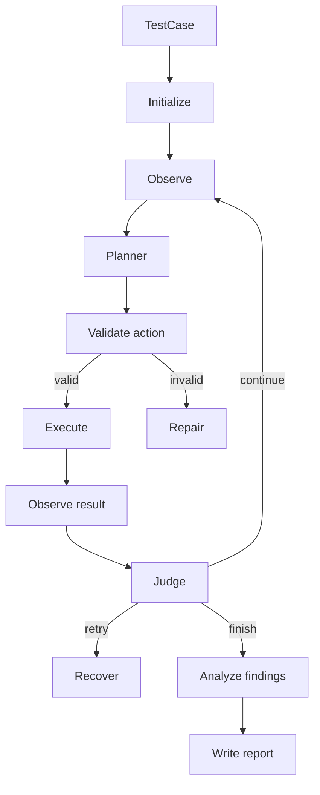

# Целевая архитектура

## Границы ответственности

### Domain models

Описывают данные между компонентами. Не знают о LangGraph, Playwright и LLM.

### Graph state

Хранит состояние одного запуска: тест-кейс, snapshot, маршрут, ошибки и статус.

### Observer

Преобразует страницу в компактное текстовое представление для модели.

### Planner

Получает цель, snapshot и историю. Возвращает одно строго типизированное
действие. Не управляет Playwright напрямую.

### Validator

Детерминированно проверяет действие до исполнения: обязательные аргументы,
разрешенный домен, повторения и опасные операции.

### Executor

Единственный компонент, работающий с Playwright `Page`. Возвращает
`ActionResult`, но не решает, достигнута ли бизнес-цель.

### Judge

Определяет переход графа: продолжить, повторить, завершить успешно, завершить с
ошибкой или запросить человека.

### Analyzer

Отделяет дефект продукта от ошибки агента, окружения или тестовых данных.

### Reporter

Записывает маршрут, findings, screenshots и trace.

### Test generator

Преобразует подтвержденный успешный маршрут в стабильный Playwright-тест и
повторно запускает его.
