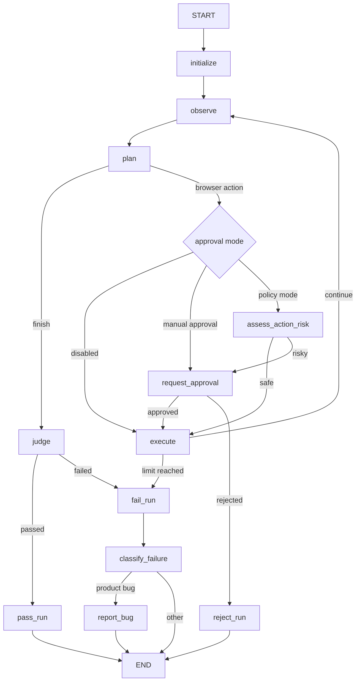

# Architecture

## Назначение проекта

`UiBrowserAgent` - учебный, но архитектурно полноценный AI-агент для
автоматизированного UI-тестирования web-сайта.

На вход система принимает `TestCase`, запускает браузер, наблюдает страницу,
выбирает действия через LLM, выполняет их через Playwright, записывает маршрут,
проверяет ожидаемые результаты, классифицирует сбои, формирует bug report,
сохраняет run report, history и использует human feedback memory.

## Главная архитектурная идея

Проект намеренно разделен на слои:

```text
Domain contracts
  -> Agent state
  -> LLM roles
  -> Deterministic browser tools
  -> LangGraph workflow
  -> Runner composition
  -> Persistence and memory
  -> Evaluation and observability
```

LLM не управляет браузером напрямую. Модель выбирает строго типизированное
следующее действие, а deterministic executor переводит это действие в browser
side effect.

## Слои проекта

### Domain

Файл:

```text
src/browser_agent/domain/models.py
```

Содержит Pydantic-контракты:

- `TestCase`;
- `BrowserAction`;
- `BrowserTarget`;
- `ActionResult`;
- `ExecutionStep`;
- `JudgeVerdict`;
- `RunTermination`;
- `FailureClassification`;
- `BugReport`;
- `RunReport`;
- `ActionApproval`;
- `ApprovalPolicyDecision`.

Правило: domain не зависит от LangGraph, LangChain, Playwright, файловой
системы или LangSmith.

Зачем: доменные модели становятся стабильным языком между всеми слоями.

### Agent State

Файл:

```text
src/browser_agent/state.py
```

`AgentState` - `TypedDict`, который описывает рабочую память одного запуска:

```text
test_case
current_url
route
step_count
failure_count
status
page_snapshot
proposed_action
last_result
verdict
termination
classification
bug_report
action_approval
approval_policy_decision
memory_context
```

State в LangGraph обновляется частичными dict update. Ноды возвращают только
измененные поля.

### LLM Roles

LLM-роли разделены по ответственности:

```text
planner.py     -> выбрать одно следующее BrowserAction
judge.py       -> независимо проверить expected results
classifier.py  -> классифицировать failed run
reporter.py    -> создать structured BugReport
```

Каждая роль имеет:

- отдельный prompt;
- отдельную Pydantic output schema;
- отдельные тесты.

Почему так: один универсальный prompt быстро становится неуправляемым. Отдельные
роли легче тестировать, измерять и менять.

### Browser Infrastructure

Файлы:

```text
browser.py
observer.py
executor.py
```

`PlaywrightBrowser` адаптирует Playwright к языку агента:

- `open`;
- `snapshot`;
- `click`;
- `fill`;
- `press`;
- `assert_text`;
- `screenshot`.

`observer.py` читает текущее состояние страницы:

```python
{"current_url": browser.current_url, "page_snapshot": snapshot}
```

`executor.py` выполняет `BrowserAction`, сохраняет screenshot, возвращает
`ActionResult` и добавляет `ExecutionStep` в route.

### LangGraph Workflow

Файл:

```text
src/browser_agent/graph.py
```

Граф связывает роли и deterministic nodes:



### Runner Composition

Файл:

```text
src/browser_agent/runner.py
```

`run_agent()` является composition layer:

- открывает `test_case.start_url`;
- строит graph;
- подключает trace config или checkpoint config;
- готовит `memory_context` из `feedback_store`;
- стримит graph state;
- вызывает `on_state`;
- строит `RunReport`;
- сохраняет report;
- сохраняет history.

Именно runner связывает инфраструктуру. Ноды графа не знают о JSONL-хранилищах,
папках artifacts и CLI.

### Persistence And Memory

Файлы:

```text
run_history.py
feedback.py
feedback_retrieval.py
feedback_cli.py
persistence.py
```

В проекте есть несколько видов persistence:

- LangGraph checkpointing через `thread_id`;
- run report как JSON/Markdown;
- run history как JSONL;
- human feedback как JSONL;
- LangSmith traces and experiment data.

### Evaluation

Файлы:

```text
src/browser_agent/evaluation/
scripts/evaluate_*.py
scripts/run_*_experiment.py
evaluations/*.json
```

Evaluation разделена на:

- Planner component evaluation;
- Judge evaluation;
- deterministic end-to-end evaluation;
- live end-to-end evaluation;
- LangSmith experiments.

## Поток данных

Упрощенный поток данных:

```text
TestCase
  -> AgentState
  -> page_snapshot
  -> BrowserAction
  -> ActionResult
  -> ExecutionStep[]
  -> JudgeVerdict
  -> RunTermination
  -> FailureClassification
  -> BugReport
  -> RunReport
  -> RunHistoryRecord
```

Feedback flow:

```text
HumanFeedbackRecord
  -> JsonlFeedbackStore
  -> FeedbackRetrievalQuery
  -> retrieve_feedback()
  -> format_feedback_for_prompt()
  -> memory_context
  -> planner prompt
```

## Поток управления

Основной successful path:

```text
initialize
  -> observe
  -> plan
  -> execute
  -> observe
  -> plan(finish)
  -> judge
  -> pass_run
  -> END
```

Failure path:

```text
execute fails or judge fails or limits reached
  -> fail_run
  -> classify_failure
  -> optional report_bug
  -> END
```

Human approval path:

```text
plan
  -> request_approval
  -> execute or reject_run
```

Policy approval path:

```text
plan
  -> assess_action_risk
  -> execute or request_approval
```

## Почему сделано именно так

### Почему graph, а не while-loop

Можно было написать обычный цикл:

```python
while not done:
    observe()
    plan()
    execute()
```

Но LangGraph дает:

- явные nodes;
- conditional edges;
- checkpointing;
- interrupt/resume;
- state snapshots;
- более удобную observability.

### Почему Pydantic

LLM output ненадежен. Pydantic дает:

- runtime validation;
- structured schema;
- serialization;
- тестируемые контракты;
- self-documenting models.

### Почему executor deterministic

LLM не должна выполнять side effects напрямую. Модель выбирает действие, а
executor строго dispatch-ит поддерживаемые операции.

### Почему Judge независимый

Planner может ошибиться или преждевременно сказать `finish`. Judge не доверяет
planner-у и проверяет expected results по snapshot, route и evidence.

### Почему feedback не читается внутри planner

Planner принимает `memory_context`, но не знает, откуда он взялся. Retrieval
делает runner. Это сохраняет planner тестируемым и не привязывает его к файловой
системе.

## Runtime artifacts

Локальные runtime-данные пишутся в:

```text
artifacts/
```

И не должны коммититься.

Коммитабельные demo inputs лежат в:

```text
examples/
```

Например:

```text
examples/feedback/first-real-agent.feedback.jsonl
```
