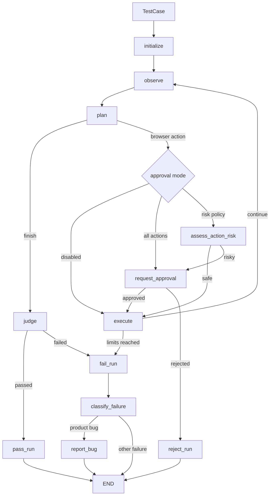

# Архитектура Browser Testing Agent

## Текущий workflow



## Слои

### Domain

`models.py` содержит Pydantic-контракты. Модели не должны зависеть от
LangGraph, Playwright, LangSmith или файловой системы.

### Agent roles

- `planner.py` выбирает одно следующее действие;
- `judge.py` проверяет expected results;
- `classifier.py` объясняет failed run;
- `reporter.py` создаёт структурированный `BugReport`.

Каждая LLM-роль имеет отдельный prompt и structured output.

### Deterministic policies

- `approval_policy.py` решает, требуется ли human review;
- routers в `graph.py` выбирают ветки;
- Pydantic валидирует границы данных.

Решения безопасности не должны зависеть только от LLM.

### Browser infrastructure

- `browser.py` адаптирует Playwright к интерфейсу агента;
- `observer.py` получает компактный snapshot;
- `executor.py` является единственным слоем, выполняющим browser side effects.

### Workflow

`graph.py` связывает роли, policies и tools. Ноды возвращают partial state
updates, а routers не выполняют side effects.

### Application

`runner.py` отвечает за composition:

- открывает start URL;
- компилирует и запускает граф;
- подключает tracing/checkpointing;
- сохраняет итоговый отчёт.

### Output

- `reporting.py` преобразует final `AgentState` в `RunReport`;
- `templates/run_report.md.j2` формирует Markdown;
- JSON используется для программных интеграций.

### Evaluation

`planner_evaluation.py` содержит dataset contracts, scorers и LangSmith adapter
для component evaluation Planner. Evaluation не является частью production
workflow и запускается отдельными scripts.

## Runtime data

```text
TestCase
  -> AgentState
  -> ExecutionStep[]
  -> JudgeVerdict / RunTermination
  -> FailureClassification / BugReport
  -> RunReport
```

Разные механизмы хранения:

```text
AgentState  -> рабочая память одного выполнения
checkpoint  -> снимки одного thread
LangSmith   -> observability и experiments
RunReport   -> итоговый пользовательский артефакт
```

## Production-направление

По мере роста пакет следует разделить на подпакеты:

```text
browser_agent/
├── domain/
├── agents/
├── workflow/
├── infrastructure/
├── application/
├── reporting/
└── evaluation/
```

Миграцию нужно делать по границам ответственности и сопровождать тестами.
Перенос всех файлов одновременно не даёт пользовательской ценности и создаёт
ненужный риск изменения импортов.
