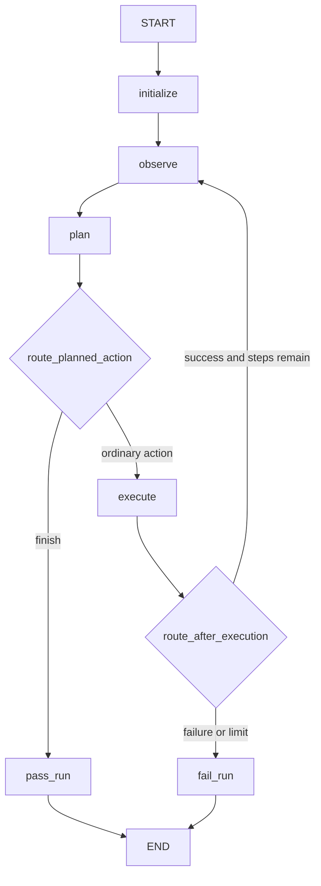

# Урок 10. Первый автономный цикл

## Что значит «автономный»

Предыдущий граф выполнил только один проход:

```text
observe -> plan -> execute -> END
```

После действия страница могла измениться, но агент больше ее не наблюдал.

Автономный агент повторяет цикл:

```text
observe -> plan -> execute -> observe -> plan -> ...
```

до одного из условий:

- planner сообщил, что цель достигнута;
- browser action завершился ошибкой;
- достигнут максимальный лимит действий.

## Целевой граф



Это первый граф, который сам:

1. наблюдает среду;
2. выбирает действие;
3. изменяет среду;
4. наблюдает изменившуюся среду;
5. принимает решение о завершении.

## Два разных router

Router отвечает на один конкретный вопрос. Не следует создавать одну большую
функцию, которая решает все.

### `route_planned_action`

Работает после planner.

Вопрос:

```text
Модель предложила browser action или сообщила о завершении?
```

Если:

```python
state["proposed_action"].action == BrowserActionType.FINISH
```

вернуть:

```python
"pass_run"
```

Иначе:

```python
"execute"
```

Почему `finish` не проходит через executor: `finish` не является воздействием
на браузер. Это управляющий сигнал графу.

### `route_after_execution`

Работает после executor.

Вопрос:

```text
Можно ли выполнять следующий цикл?
```

Порядок проверок:

1. Если `last_result.success` равен `False`, вернуть `"fail_run"`.
2. Если `step_count >= test_case.max_steps`, вернуть `"fail_run"`.
3. Иначе вернуть `"observe"`.

Почему ошибка сразу завершает сценарий: на этом уроке еще нет recovery.
Позже вместо прямого failure появится ветка повторного планирования.

## Порядок обновления state

После `execute` node возвращает:

```python
{
    "last_result": result,
    "step_count": state["step_count"] + 1,
}
```

Только после объединения этого update LangGraph вызывает
`route_after_execution`.

Поэтому router видит уже новый счетчик и новый результат.

Это тот же принцип, который мы изучали в учебном loop-графе.

## Почему после execute снова `observe`

Executor знает:

- успешно ли выполнена команда;
- URL до и после;
- screenshot.

Но он не создает новый model-friendly snapshot.

Например, после click:

```text
до:  button "Continue"
после: heading "Goal reached"
```

Planner должен получить новое наблюдение. Поэтому переход:

```text
execute -> observe
```

а не:

```text
execute -> plan
```

## Завершение planner-ом

После повторного observe модель видит:

```text
Goal reached
```

и возвращает:

```python
BrowserAction(
    action="finish",
    target=None,
    value=None,
    reason="The goal is reached.",
)
```

Router переводит граф в `pass_run`, который записывает:

```python
{"status": "passed"}
```

## Важное ограничение

Сейчас planner сам решает, что цель достигнута.

Это потенциально ненадежно: LLM может ошибочно вернуть `finish`.
В полноценной системе появится Judge, который отдельно проверяет expected
results и evidence.

Пока `finish` нужен, чтобы изучить управляющий цикл.

## Задание 10.1: routers

Работайте в `src/browser_agent/autonomous_graph.py`.

Импортируйте:

```python
from browser_agent.models import BrowserActionType
from browser_agent.state import AgentState
```

Реализуйте:

```python
def route_planned_action(state: AgentState) -> str:
```

и:

```python
def route_after_execution(state: AgentState) -> str:
```

Сначала запустите только router-тесты:

```powershell
.\.venv\Scripts\python.exe -m pytest tests\test_autonomous_graph.py -k route -q
```

## Задание 10.2: граф

Переиспользуйте:

```python
initialize
make_observe_node(browser)
make_plan_node(model)
make_execute_node(browser)
pass_run
fail_run
```

Зарегистрируйте узлы:

- `initialize`;
- `observe`;
- `plan`;
- `execute`;
- `pass_run`;
- `fail_run`.

Обычные ребра:

```text
START -> initialize
initialize -> observe
observe -> plan
pass_run -> END
fail_run -> END
```

Условные переходы после `plan`:

```python
{
    "execute": "execute",
    "pass_run": "pass_run",
}
```

Условные переходы после `execute`:

```python
{
    "observe": "observe",
    "fail_run": "fail_run",
}
```

## Полный успешный сценарий теста

Начальный snapshot:

```text
button "Continue"
```

Planner:

```python
click Continue
```

Executor меняет fake browser:

```text
current_url = /done
goal_reached = True
```

Observer повторно получает:

```text
Goal reached
```

Planner возвращает `finish`.

Граф переходит в `pass_run`.

Ожидаемый порядок browser-вызовов:

```python
[
    ("snapshot",),
    ("click", 'button "Continue"'),
    ("screenshot",),
    ("snapshot",),
]
```

Обратите внимание: после `finish` screenshot не делается, потому что browser
action не выполнялся.

## Полный ошибочный сценарий

Если `browser.click()` выбрасывает:

```python
RuntimeError("Button is blocked")
```

Executor превращает ошибку в:

```python
ActionResult(success=False, error="Button is blocked")
```

Router возвращает `"fail_run"`, и статус становится `failed`.

Исключение не выходит наружу из графа.

## Проверка

```powershell
.\.venv\Scripts\python.exe -m pytest tests\test_autonomous_graph.py -q
```

Итог:

```text
40 passed
```

## Что нужно понять

1. Почему после plan и execute используются разные routers.
2. Почему `finish` не должен попадать в executor.
3. Почему после execute нужен новый observe.
4. Когда обновляется `step_count`.
5. Почему limit проверяет обычный код, а не LLM.
6. Почему `finish` от planner пока нельзя считать надежной проверкой цели.
