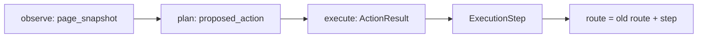

# Урок 11. Трасса выполнения агента

## Зачем нужна трасса

Наш агент уже выполняет автономный цикл:

```text
observe -> plan -> execute -> observe -> ...
```

Но после завершения мы видим в state только последнее действие и последний
результат:

```python
state["proposed_action"]
state["last_result"]
```

Предыдущие шаги перезаписываются. Для реальной тестовой системы этого
недостаточно. Нам нужно ответить:

1. Что увидел агент перед действием?
2. Какое действие выбрала модель и почему?
3. Что фактически сделал browser adapter?
4. Было ли действие успешным?
5. Как изменился URL?
6. Где находится скриншот?
7. На каком шаге возникла ошибка?

Последовательность таких записей называется **execution trace**, трассой или
журналом выполнения.

## Состояние агента и память

Важно различать несколько видов памяти.

### Рабочее состояние

`AgentState` — данные одного текущего запуска графа:

```text
current_url
page_snapshot
proposed_action
last_result
step_count
route
```

Это краткосрочная память процесса. Ноды читают её и возвращают частичные
обновления.

### Трасса

`route` — история уже выполненных действий внутри запуска. Она нужна для:

- отладки;
- объяснения решения агента;
- итогового отчёта;
- анализа возможного бага;
- будущей генерации Playwright-теста.

### Долговременная память

База данных, LangGraph checkpointer и знания между разными запусками появятся
позже. Сейчас мы не учим агента помнить другие тесты. Мы сохраняем факты только
внутри одного выполнения.

## Модель одного шага

Создадим Pydantic-модель:

```python
class ExecutionStep(BaseModel):
    step_number: int
    page_snapshot: str
    action: BrowserAction
    result: ActionResult
```

Один объект связывает четыре части одного события:

```text
наблюдение -> решение -> воздействие -> результат
```

### Почему хранится snapshot до действия

Planner выбрал действие на основании текущего `page_snapshot`. Поэтому для
объяснимости нужно сохранить именно это наблюдение:

```text
snapshot N -> action N -> result N
```

Следующий snapshot относится уже к следующему шагу.

### Почему `reason` не отдельное поле

Обоснование уже входит в:

```python
step.action.reason
```

Не нужно дублировать одни данные в нескольких местах.

### Почему URL находится в `ActionResult`

Результат уже содержит:

```python
url_before
url_after
```

Это позволяет увидеть навигацию, не создавая отдельную модель маршрута URL.

## Частичное обновление LangGraph

Нода не должна возвращать весь `AgentState`. Она возвращает изменившиеся поля:

```python
return {
    "last_result": result,
    "step_count": next_step_number,
    "route": updated_route,
}
```

LangGraph объединит update с текущим state.

До урока 11 executor возвращал:

```python
{
    "last_result": result,
    "step_count": state["step_count"] + 1,
}
```

Теперь он также должен вернуть новую версию `route`.

## Не изменяем входной state

Так делать не следует:

```python
state["route"].append(step)
return {"route": state["route"]}
```

Нода мутирует объект, который получила от графа. Это усложняет тестирование,
повторное выполнение, checkpointing и поиск причины изменений.

Создаём новый список:

```python
updated_route = [*state["route"], step]
```

или:

```python
updated_route = state["route"] + [step]
```

Старый список остаётся неизменным. Такой стиль называется immutable update.

## Почему трассу пишет executor

Planner ещё не знает, получилось ли действие. Observer не отвечает за
выполнение. Только executor одновременно имеет:

- `page_snapshot`, на основании которого выбрано действие;
- `proposed_action`;
- полученный `ActionResult`;
- номер шага.

Поэтому именно executor формирует завершённую запись `ExecutionStep`.

Это пример принципа: компонент должен записывать факт там, где у него есть все
необходимые данные для этого факта.

## Поток данных



На следующей итерации текущее наблюдение и действие перезапишутся, но объект,
добавленный в `route`, сохранится.

## Задание 11.1. Доменная модель

Работай в:

```text
src/browser_agent/models.py
```

В классе `ExecutionStep` объяви:

```python
step_number: int = Field(ge=1)
page_snapshot: str
action: BrowserAction
result: ActionResult
```

Почему `ge=1`: пользовательские шаги нумеруются с единицы, а нулевое значение
будет означать ошибку формирования трассы.

Проверка:

```powershell
.\.venv\Scripts\python.exe -m pytest tests\test_execution_trace.py -k model -q
```

## Задание 11.2. Контракт state

Работай в:

```text
src/browser_agent/state.py
```

1. Импортируй `ExecutionStep`.
2. Замени тип `route`:

```python
route: NotRequired[list[ExecutionStep]]
```

`ActionResult` описывает только исход действия. `ExecutionStep` описывает весь
контекст шага, поэтому именно он должен храниться в маршруте.

TypedDict проверяется статическими анализаторами, а не во время выполнения.
Из-за этого отдельного падающего runtime-теста на аннотацию нет. Но правильный
тип важен для IDE, mypy и понимания контракта.

## Задание 11.3. Запись шага

Работай в:

```text
src/browser_agent/executor.py
```

После `execute_action(...)`:

1. Вычисли номер нового шага.
2. Создай `ExecutionStep`.
3. Создай новый список из старого маршрута и нового шага.
4. Верни этот список в поле `route`.

Ожидаемый смысл:

```text
next step number = старый step_count + 1
step = snapshot + action + result
new route = old route + step
```

Не копируй готовый код из архива: сначала попробуй собрать update самостоятельно.

Проверка:

```powershell
.\.venv\Scripts\python.exe -m pytest tests\test_execution_trace.py -k execute -q
```

## Задание 11.4. Полная проверка

После реализации запусти:

```powershell
.\.venv\Scripts\python.exe -m pytest -q
```

Ожидаемый результат:

```text
27 passed
```

## Что не нужно менять

В этом уроке не меняй:

- `planner.py`;
- `observer.py`;
- `graph.py`;
- router-функции.

Граф уже переносит `route` между итерациями. Executor должен только вернуть
обновлённое значение этого поля.

## Вопросы для самопроверки

Перед отправкой решения попробуй ответить своими словами:

1. Чем `last_result` отличается от `route`?
2. Почему один `ActionResult` недостаточен для отчёта?
3. Почему в `ExecutionStep` сохраняется snapshot до действия?
4. Почему executor, а не planner, добавляет запись в трассу?
5. Что значит «частичное обновление state»?
6. Почему лучше создать новый список, чем вызвать `append()`?
7. Сколько раз LLM вызывается при добавлении записи в трассу?

Ответ на последний вопрос: нисколько. Трассировка — детерминированная
инфраструктурная логика, а не интеллектуальное решение.
