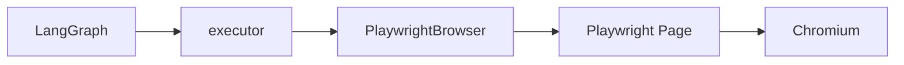

# Урок 12. Настоящий браузер через Playwright

## Что мы строим

До этого `executor` работал с объектом `browser`, у которого ожидались методы:

```python
browser.current_url
browser.snapshot()
browser.click(target)
browser.fill(target, value)
browser.press(target, value)
browser.assert_text(target)
browser.screenshot()
```

Fake browser в тестах доказывал, что логика агента работает, но не управлял
настоящим сайтом. Теперь создаём **adapter**:

```text
наш агентский интерфейс -> Playwright API -> Chromium
```

Класс находится в:

```text
src/browser_agent/browser.py
```

После урока executor менять не потребуется. Он продолжит вызывать тот же
интерфейс, но за ним будет стоять реальный `Page` Playwright.

## Что такое adapter

LangGraph не должен знать о `page.get_by_role()`, browser context или запуске
Chromium. Executor также не должен зависеть от конкретной библиотеки.



Adapter переводит один интерфейс в другой:

```python
browser.click('role=button[name="Add"]')
```

в:

```python
page.get_by_role("button", name="Add", exact=True).click()
```

Это даёт:

- изоляцию Playwright от логики агента;
- возможность тестировать executor без запуска Chromium;
- одно место для локаторов, ожиданий и скриншотов;
- возможность позднее заменить Playwright другим browser backend;
- контролируемую границу между решением LLM и исполнением.

## Dependency injection

Adapter не запускает Playwright сам. Он получает готовый `page`:

```python
browser = PlaywrightBrowser(page)
```

Это называется dependency injection: зависимость передаётся объекту снаружи.

Жизненным циклом управляет точка запуска:

```python
with sync_playwright() as playwright:
    chromium = playwright.chromium.launch(...)
    page = chromium.new_page()
    adapter = PlaywrightBrowser(page)
```

Почему это полезно:

- тест может передать `FakePage`;
- приложение решает, использовать Chromium, Firefox или WebKit;
- приложение решает, показывать окно или запускать headless;
- adapter отвечает только за операции над страницей.

## Почему LLM не генерирует Playwright-код

Опасный вариант:

```text
LLM -> "page.locator(...).click()"
```

Тогда пришлось бы исполнять сгенерированный код. Он может быть ошибочным,
непредсказуемым или небезопасным.

Наш вариант:

```text
LLM -> BrowserAction(action="click", target="label=Task")
executor -> browser.click("label=Task")
adapter -> page.get_by_label("Task").click()
```

LLM выбирает действие и данные. Исполняемый код заранее написан нами.

Это фундаментальный принцип tool-using agents:

```text
модель выбирает инструмент и аргументы;
приложение валидирует и выполняет заранее определённый инструмент.
```

## Язык локаторов

На этом этапе поддерживаем четыре формы.

### Role

```text
role=button[name="Add"]
```

Перевод:

```python
page.get_by_role("button", name="Add", exact=True)
```

Role locator опирается на accessibility role и accessible name. Обычно это
наиболее устойчивый и близкий к поведению пользователя локатор.

### Label

```text
label=Task
```

Перевод:

```python
page.get_by_label("Task")
```

Подходит для `input`, связанного с HTML-элементом `label`.

### Text

```text
text=Saved
```

Перевод:

```python
page.get_by_text("Saved", exact=True)
```

На этом уроке используем его для проверки видимого текста.

### CSS

```text
css=.todo-list li
```

Перевод:

```python
page.locator(".todo-list li")
```

CSS оставляем как запасной вариант. Предпочтительнее role и label: они меньше
зависят от структуры DOM и лучше отражают пользовательский интерфейс.

### Неизвестный формат

Строка:

```text
button "Add"
```

не соответствует нашему контракту. Adapter должен выбросить:

```python
ValueError("Unsupported target: ...")
```

Fail fast лучше, чем случайно нажать неправильный элемент.

## `_resolve_target`

Метод начинается с подчёркивания:

```python
def _resolve_target(self, target: str):
```

Это соглашение Python: метод считается внутренней частью класса. Публичные
методы `click`, `fill`, `press` и `assert_text` используют его, но остальной
проект не должен зависеть от деталей парсинга.

Для role удобно использовать регулярное выражение:

```python
import re

match = re.fullmatch(
    r'role=([A-Za-z0-9_-]+)\[name="([^"]+)"\]',
    target,
)
```

`fullmatch` требует совпадения всей строки. Группы содержат:

```python
role = match.group(1)
name = match.group(2)
```

Для остальных форм достаточно проверить prefix:

```python
target.startswith("label=")
target.removeprefix("label=")
```

## Accessibility snapshot

Planner не должен получать весь HTML. HTML содержит scripts, styles, служебные
атрибуты и много токенов.

Мы используем:

```python
page.locator("body").aria_snapshot()
```

Accessibility tree описывает интерфейс ближе к тому, как его воспринимают
пользователь и screen reader:

```text
- heading "Tasks"
- textbox "Task"
- button "Add"
```

Это компактное наблюдение для LLM.

Важно: snapshot — наблюдение, а не locator. В следующем уроке мы уточним prompt,
чтобы planner возвращал target строго в нашем языке локаторов.

## Ожидания Playwright

Playwright locators имеют auto-waiting. Например:

```python
locator.click()
```

ждёт, пока элемент станет доступен для действия.

Для `assert_text` пока используем:

```python
locator.wait_for(state="visible")
```

Метод не делает проверку через Python `assert`. Он ждёт доказательство в
браузере, а timeout Playwright превращается в ошибку выполнения.

Позже Judge будет проверять более сложные ожидаемые результаты.

## Скриншоты

Каждый вызов должен создавать новый путь:

```text
artifacts/step-001.png
artifacts/step-002.png
```

Алгоритм:

1. Создать каталог через `mkdir(parents=True, exist_ok=True)`.
2. Увеличить `self.screenshot_number`.
3. Сформировать путь с форматированием `:03d`.
4. Вызвать `page.screenshot(path=..., full_page=True)`.
5. Вернуть строковый путь.

Пример форматирования:

```python
f"step-{self.screenshot_number:03d}.png"
```

`3` станет `003`.

## Задание 12.1. Навигация

Реализуй в `src/browser_agent/browser.py`:

```python
@property
def current_url(self) -> str:
```

Он должен вернуть:

```python
self.page.url
```

Затем:

```python
def open(self, url: str) -> None:
```

должен делегировать навигацию:

```python
self.page.goto(url)
```

Проверка:

```powershell
.\.venv\Scripts\python.exe -m pytest tests\test_browser.py -k current -q
```

## Задание 12.2. Преобразование target

Реализуй `_resolve_target` для:

```text
role=button[name="Add"]
label=Task
text=Saved
css=.todo-list li
```

Неизвестный формат должен приводить к `ValueError`.

Проверка:

```powershell
.\.venv\Scripts\python.exe -m pytest tests\test_browser.py -k resolve -q
```

## Задание 12.3. Snapshot

Реализуй:

```python
def snapshot(self) -> str:
```

Он должен:

1. получить locator `body`;
2. вызвать у него `aria_snapshot()`;
3. вернуть полученную строку.

Проверка:

```powershell
.\.venv\Scripts\python.exe -m pytest tests\test_browser.py -k snapshot -q
```

## Задание 12.4. Browser actions

Каждый метод сначала получает locator через `_resolve_target`.

Соответствия:

```text
click       -> locator.click()
fill        -> locator.fill(value)
press       -> locator.press(value)
assert_text -> locator.wait_for(state="visible")
```

Проверка:

```powershell
.\.venv\Scripts\python.exe -m pytest tests\test_browser.py -k actions -q
```

## Задание 12.5. Screenshot

Реализуй нумерованные полноэкранные скриншоты согласно алгоритму выше.

Проверка:

```powershell
.\.venv\Scripts\python.exe -m pytest tests\test_browser.py -k screenshot -q
```

## Полная автоматическая проверка

```powershell
.\.venv\Scripts\python.exe -m pytest -q
```

После реализации ожидается:

```text
36 passed
```

Unit-тесты используют `FakePage`, но тестируют не fake browser. Они проверяют,
что настоящий adapter формирует правильные Playwright-вызовы. Это позволяет
получать быстрые и стабильные ошибки без запуска Chromium для каждого теста.

## Первый запуск настоящего Chromium

Установи browser binary, если ещё не сделал:

```powershell
.\.venv\Scripts\python.exe -m playwright install chromium
```

После прохождения тестов запусти:

```powershell
.\.venv\Scripts\python.exe scripts\smoke_playwright.py
```

Откроется видимый Chromium с замедлением:

```python
headless=False
slow_mo=500
```

Сценарий работает с локальной страницей:

```text
examples/playwright_fixture.html
```

Он должен:

1. открыть страницу;
2. вывести первоначальный accessibility snapshot;
3. заполнить поле `Task`;
4. нажать `Add`;
5. дождаться текста `Learn Playwright`;
6. вывести новый snapshot;
7. сохранить screenshot;
8. оставить окно открытым до нажатия Enter.

Здесь уже нет fake browser: команды выполняет настоящий Playwright в настоящем
Chromium.

## Почему пока без графа и Ollama

Мы вводим по одной новой причине ошибки.

На этом уроке проверяем:

```text
target -> locator -> browser action
```

Если одновременно добавить LLM и LangGraph, при сбое будет неясно:

- модель выбрала неправильный target;
- prompt не описал формат;
- adapter неверно распарсил target;
- Playwright не нашёл элемент;
- граф выбрал неправильную ветку.

На следующем уроке, когда adapter будет проверен отдельно, подключим его к
текущему графу и Ollama.

## Вопросы для самопроверки

1. Зачем нужен adapter, если можно передать `page` прямо в executor?
2. Почему `Page` передаётся через constructor?
3. Чем accessibility snapshot отличается от HTML?
4. Почему LLM возвращает target, а не Python-код?
5. Почему role/label предпочтительнее CSS?
6. Что делает Playwright auto-waiting?
7. Почему неизвестный target должен приводить к явной ошибке?
8. Кто управляет запуском и закрытием Chromium: adapter или точка запуска?
