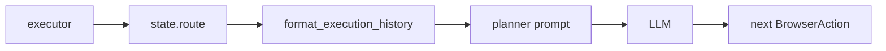

# Урок 14. Краткосрочная память planner-а

## Почему появился этот урок

В реальном запуске агент успешно:

1. заполнил поле `Task`;
2. нажал `Add`;
3. добавил задачу на страницу.

Но затем снова выполнил:

```text
fill → click → fill → click
```

и завершился по `max_steps`.

Трасса выполнения уже находилась в:

```python
state["route"]
```

Однако planner получал только:

```text
goal
test_data
expected
page_snapshot
```

Для модели каждый новый вызов выглядел почти как новый запуск. Она видела
текущую страницу, но не получала явных фактов о собственных прошлых действиях.

## Память агента — это данные, переданные в следующий цикл

LLM не хранит Python-объекты между независимыми вызовами `invoke()`.

```python
chain.invoke(input_1)
chain.invoke(input_2)
```

Второй вызов не знает содержимое первого, если приложение само не передало
нужную информацию.

Это фундаментальный принцип:

```text
память агента не возникает автоматически;
приложение сохраняет состояние и снова помещает его в контекст модели.
```

LangGraph сохраняет `route` в `AgentState`, но LangGraph не решает, какие поля
нужно показать LLM. Это ответственность planner-а.

## Какие виды памяти уже есть

### Текущее наблюдение

```python
state["page_snapshot"]
```

Отвечает на вопрос:

```text
Что находится на странице сейчас?
```

### Последний результат

```python
state["last_result"]
```

Отвечает:

```text
Чем закончилось последнее действие?
```

### Полная трасса

```python
state["route"]
```

Отвечает:

```text
Что агент уже делал в этом запуске?
```

### Будущая долговременная память

Позже база данных или RAG смогут отвечать:

```text
Какие похожие сценарии выполнялись раньше?
Какие баги уже находили на этом сайте?
Какие особенности продукта известны системе?
```

В этом уроке речь только о краткосрочной памяти одного запуска.

## Почему нельзя просто передать `route` целиком

Можно сериализовать:

```python
[step.model_dump() for step in route]
```

Но каждый `ExecutionStep` содержит:

- полный `page_snapshot`;
- подробный `BrowserAction`;
- `ActionResult`;
- путь к screenshot;
- URL;
- error.

Snapshots могут быть большими и будут дублироваться с текущим snapshot.
Screenshot path не помогает planner-у принимать решение. С ростом маршрута
prompt станет дорогим, медленным и шумным.

Вместо необработанной истории создадим компактное представление.

## Формат одного шага

История должна содержать факты:

```text
Step 1: action=fill, target=label=Task, value=Learn agents,
success=True, url=https://example.com/start -> https://example.com/tasks
```

Если возникла ошибка:

```text
Step 2: action=click, target=role=button[name="Add"], value=None,
success=False, url=... -> ..., error=Button is blocked
```

Planner видит:

- порядковый номер;
- выполненное действие;
- target и value;
- успех или ошибку;
- изменение URL.

Planner не получает:

- старые accessibility snapshots;
- screenshot paths;
- Pydantic repr;
- внутренние Python-типы.

Это называется **context engineering**: мы не просто сохраняем память, а
выбираем полезную форму её представления модели.

## Детерминированное форматирование

Функция:

```python
def format_execution_history(route: list[ExecutionStep]) -> str:
```

не вызывает LLM. Она должна всегда одинаково преобразовывать одинаковый route.

Почему это важно:

- результат легко тестировать;
- формат prompt предсказуем;
- логика не зависит от ещё одной модели;
- ошибки не скрываются за генерацией текста;
- стоимость равна обычной обработке Python-объектов.

Не вся «память агента» должна быть интеллектуальной. Часто лучший memory layer
— обычная функция форматирования.

## Пустая история

Для пустого route возвращаем:

```text
No actions have been executed yet.
```

Это лучше пустой строки. Модель явно понимает, что перед ней первый шаг, а не
случайно потерянный контекст.

## Как собрать строку

Сначала создай список строк:

```python
lines = []
```

Для каждого шага подготовь базовую строку:

```python
line = (
    f"Step {step.step_number}: "
    f"action={step.action.action}, "
    f"target={step.action.target}, "
    f"value={step.action.value}, "
    f"success={step.result.success}, "
    f"url={step.result.url_before} -> {step.result.url_after}"
)
```

Если есть ошибка:

```python
if step.result.error is not None:
    line += f", error={step.result.error}"
```

Добавь строку:

```python
lines.append(line)
```

В конце:

```python
return "\n".join(lines)
```

Обрати внимание: `BrowserActionType` наследуется от `StrEnum`, поэтому внутри
f-string:

```python
f"{step.action.action}"
```

даёт значение вроде `fill`, а не сложное представление enum.

## Поток памяти



После каждого execute:

```text
route становится длиннее
→ следующий plan получает обновлённую историю
→ модель знает, что уже произошло
```

## Где история появляется в prompt

Human message теперь содержит:

```text
Goal:
...

Test data:
...

Expected results:
...

Execution history:
...

Current page:
...
```

Так модель сопоставляет три времени:

```text
цель и expected        → куда нужно прийти
execution history      → что уже сделали
current page           → где находимся сейчас
```

## Почему история не заменяет snapshot

История может сообщить:

```text
Step 2: click Add succeeded
```

Но успешный `click()` означает только, что Playwright смог выполнить клик.
Это ещё не доказывает, что задача появилась.

Текущий snapshot сообщает фактическое состояние после воздействия.

Правильное рассуждение:

```text
я нажал Add успешно
    +
на текущей странице видна Learn agents
    =
вероятно, цель достигнута
```

Именно поэтому агенту нужны и история, и новое наблюдение.

## Почему история не заменяет Judge

Даже с памятью planner всё ещё сам решает вернуть `finish`.

История помогает избегать повторов, но не является независимой проверкой
expected results. Позже Judge будет отдельно отвечать:

```text
Доказаны ли все ожидаемые результаты?
```

Planner отвечает на другой вопрос:

```text
Какое следующее действие лучше выполнить?
```

Разделение ролей уменьшает вероятность ложного `passed`.

## Ограничение размера памяти

Пока `max_steps <= 100`, поэтому можно передавать все компактные строки. В
большой системе появятся стратегии:

- последние N шагов;
- summary старых шагов;
- выбор релевантных действий;
- хранение в checkpointer;
- retrieval по прошлым запускам.

Не нужно преждевременно добавлять сложную memory framework. Сначала создаём
прозрачный и тестируемый механизм.

## Задание 14.1. Форматирование пустой истории

Работай в:

```text
src/browser_agent/planner.py
```

Найди:

```python
def format_execution_history(route: list[ExecutionStep]) -> str:
```

Если `route` пустой, верни:

```text
No actions have been executed yet.
```

Проверка:

```powershell
.\.venv\Scripts\python.exe -m pytest tests\test_planner_memory.py -k empty -q
```

## Задание 14.2. Форматирование шагов

Для каждого `ExecutionStep` создай одну строку с полями:

```text
Step N
action
target
value
success
url_before -> url_after
error, только если не равен None
```

Не включай:

```text
step.page_snapshot
step.result.screenshot_path
```

Проверка:

```powershell
.\.venv\Scripts\python.exe -m pytest tests\test_planner_memory.py -k history -q
```

## Задание 14.3. Передача route в planner

В `make_plan_node()` сейчас временно передаётся:

```python
route=[]
```

Замени заглушку данными из state:

```python
route=state["route"]
```

Именно LangGraph переносит обновлённый route от executor к следующему вызову
planner-а.

Проверка:

```powershell
.\.venv\Scripts\python.exe -m pytest tests\test_planner_memory.py -k plan_node -q
```

## Полная проверка

```powershell
.\.venv\Scripts\python.exe -m pytest -q
```

Ожидаемый результат:

```text
42 passed
```

## Реальный повторный запуск

После тестов:

```powershell
$env:OLLAMA_MODEL="qwen3.6:35b"
.\.venv\Scripts\python.exe scripts\run_real_agent.py
```

И затем для сравнения:

```powershell
$env:OLLAMA_MODEL="gpt-oss:20b"
.\.venv\Scripts\python.exe scripts\run_real_agent.py
```

Сравни:

- количество шагов;
- последовательность actions;
- был ли повтор `fill/click`;
- вернула ли модель `finish`;
- финальный status.

Это уже маленький agent evaluation: одинаковая задача, одинаковый environment,
разные модели.

## Что мы пока не исправляем

В этом уроке не добавляй:

- Judge;
- vision;
- LangSmith;
- RAG;
- retry после невалидного target;
- сложный detector циклов.

Каждая из этих частей появится отдельно. Сейчас мы изолированно проверяем
гипотезу:

```text
Явная история действий уменьшает бессмысленные повторы planner-а.
```

## Вопросы для самопроверки

1. Почему LangGraph хранит route, но LLM всё равно его не знает?
2. Чем текущий snapshot отличается от execution history?
3. Почему нельзя считать успешный click доказательством бизнес-результата?
4. Почему мы не передаём `ExecutionStep.model_dump()` напрямую?
5. Зачем явно описывать пустую историю?
6. Почему formatter не должен вызывать LLM?
7. Где именно route обновляется?
8. Когда planner впервые увидит результат первого действия?
9. Почему память уменьшает повторы, но не гарантирует корректный `passed`?
