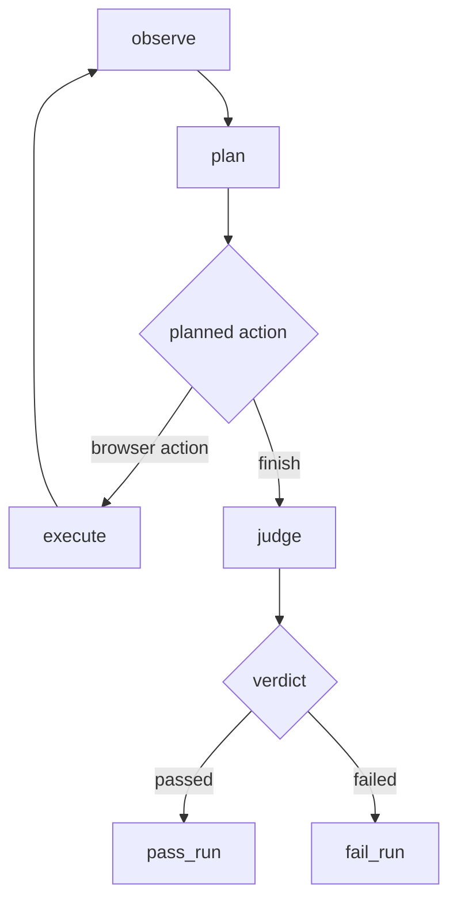

# Урок 15. Независимый Judge

## Проблема текущего графа

До этого planner мог вернуть:

```python
BrowserAction(
    action="finish",
    target=None,
    value=None,
    reason="Task added and verified.",
)
```

Router сразу направлял граф:

```text
finish → pass_run → END
```

Это означает, что один компонент одновременно:

1. выбирал browser actions;
2. решал, когда прекратить действия;
3. проверял expected results;
4. устанавливал итог теста.

Такой компонент имеет слишком много ответственности. Ошибка planner-а
превращается в ложный `passed`.

## Разделение ролей

После этого урока:

```text
Planner: какое действие выполнить дальше?
Judge: доказаны ли ожидаемые результаты?
```

Новый маршрут:



`finish` теперь означает:

```text
Planner считает, что больше действий не требуется.
```

Но не означает:

```text
Тест доказанно пройден.
```

## Judge — отдельный агент?

Judge является отдельной **агентской ролью**, потому что имеет:

- отдельную цель;
- собственный system prompt;
- собственную structured-output схему;
- отдельную ноду графа;
- ограниченный набор входных доказательств.

Но это не обязательно отдельный процесс или отдельная модель. Сейчас один
объект `ChatOllama` может использоваться дважды:

```text
тот же model
├── with_structured_output(BrowserAction) → Planner
└── with_structured_output(JudgeVerdict)  → Judge
```

Позже можно передать разные модели:

```python
build_agent_graph(
    planner_model=fast_text_model,
    judge_model=strong_vision_model,
    browser=browser,
)
```

Архитектурные роли не обязаны совпадать с физическими моделями.

## Структурированный вердикт

Недостаточно получить:

```python
{"passed": True}
```

Нам нужно знать, почему система приняла решение и какое требование проверено.

### Проверка одного expected result

```python
class ExpectedResultCheck(BaseModel):
    expected: str
    passed: bool
    evidence: str
```

Пример:

```python
ExpectedResultCheck(
    expected="Learn AI Agents is visible",
    passed=True,
    evidence='Current snapshot contains listitem "Learn AI Agents".',
)
```

### Итоговый вердикт

```python
class JudgeVerdict(BaseModel):
    passed: bool
    checks: list[ExpectedResultCheck]
    summary: str
```

Пример:

```python
JudgeVerdict(
    passed=True,
    checks=[...],
    summary="Every expected result is proven.",
)
```

## Инварианты модели

### Нужна хотя бы одна проверка

```python
checks: list[ExpectedResultCheck] = Field(min_length=1)
```

Пустой список не доказывает успех.

### Overall verdict должен соответствовать checks

Нельзя разрешать:

```python
passed=True
checks=[ExpectedResultCheck(passed=False, ...)]
```

Добавим validator:

```python
@model_validator(mode="after")
def validate_verdict(self):
    checks_passed = all(check.passed for check in self.checks)

    if self.passed != checks_passed:
        raise ValueError("passed must be true only when every check passed")

    return self
```

Это важный принцип:

```text
LLM генерирует данные;
Pydantic защищает инварианты домена.
```

Prompt просит модель быть последовательной, но validator не позволяет принять
противоречивый результат.

## Evidence

Judge получает:

- список `expected`;
- текущий accessibility snapshot;
- компактную execution history.

Он не должен использовать предположения.

Плохое evidence:

```text
The click succeeded, so the task probably exists.
```

Хорошее evidence:

```text
Current snapshot contains listitem "Learn AI Agents".
```

Успешный browser action доказывает только техническое выполнение команды:

```text
Playwright смог кликнуть.
```

Он не доказывает бизнес-результат:

```text
Задача действительно добавлена.
```

## Почему Judge получает историю

Основное доказательство результата находится в текущем snapshot. История
добавляет контекст:

```text
Step 1: fill succeeded
Step 2: click Add succeeded
Current page: listitem "Learn AI Agents"
```

Judge может связать действия с итоговым наблюдением, но обязан опираться на
факты страницы.

## Почему Judge не получает planner reason

Planner reason находится внутри истории action, но наш компактный formatter его
не передаёт. Это полезно: Judge не должен быть убеждён рассуждением planner-а.

Иначе возникнет confirmation bias:

```text
Planner: "Цель достигнута."
Judge: "Planner сказал, что цель достигнута."
```

Judge получает evidence, а не заключение planner-а.

## Judge prompt

System prompt уже находится в:

```text
src/browser_agent/judge.py
```

Human message должен содержать:

```text
Expected results:
{expected}

Execution history:
{execution_history}

Current page snapshot:
{page_snapshot}
```

Judge не получает `goal`, потому что итоговый QA-вердикт должен проверять
конкретные expected results. Goal помогает planner-у двигаться, expected
определяют критерии приёмки.

## Judge chain

Архитектура аналогична planner chain:

```python
prompt = build_judge_prompt()
structured_model = model.with_structured_output(JudgeVerdict)
return prompt | structured_model
```

Но одинаковый технический паттерн обслуживает другую роль:

```text
Planner chain → BrowserAction
Judge chain   → JudgeVerdict
```

## Judge node

`make_judge_node(model)` является фабрикой:

```python
def make_judge_node(model):
    def judge(state: AgentState) -> dict:
        verdict = judge_run(...)
        return {"verdict": verdict}

    return judge
```

Нода возвращает partial update и не меняет статус самостоятельно.

Почему:

- Judge создаёт доменный результат;
- router интерпретирует результат;
- `pass_run`/`fail_run` меняют статус.

Каждый компонент делает одну работу.

## Маршрутизация после Judge

```python
def route_after_judge(state: AgentState) -> str:
    if state["verdict"].passed:
        return "pass_run"
    return "fail_run"
```

Router остаётся детерминированным. LLM уже вызвана внутри Judge node.

## Изменение `route_planned_action`

Было:

```python
finish → pass_run
```

Станет:

```python
finish → judge
```

Обычные browser actions по-прежнему идут:

```python
action → execute
```

## Модели planner и Judge

Сигнатура builder уже подготовлена:

```python
def build_agent_graph(model, browser, judge_model=None):
```

Здесь:

- `model` — planner model;
- `judge_model` — необязательная отдельная Judge model.

Внутри:

```python
judge_model = judge_model or model
```

Если отдельная модель не передана, используется тот же объект Ollama.

Это называется dependency default: API уже поддерживает разделение моделей, но
простой запуск не требует создавать две зависимости.

## Новый state

В `AgentState` уже добавлено:

```python
verdict: NotRequired[JudgeVerdict]
```

До Judge этого поля нет. После ноды:

```python
state["verdict"]
```

содержит итоговую структуру и позже станет основой отчёта и bug analysis.

## Задание 15.1. Доменные модели

Работай в:

```text
src/browser_agent/models.py
```

Реализуй:

```python
class ExpectedResultCheck(BaseModel):
    expected: str = Field(min_length=1)
    passed: bool
    evidence: str = Field(min_length=1)
```

И:

```python
class JudgeVerdict(BaseModel):
    passed: bool
    checks: list[ExpectedResultCheck] = Field(min_length=1)
    summary: str = Field(min_length=1)
```

Добавь `model_validator(mode="after")`, запрещающий противоречие между
`passed` и результатами checks.

Проверка:

```powershell
.\.venv\Scripts\python.exe -m pytest tests\test_judge_models.py -q
```

Ожидается:

```text
3 passed
```

## Задание 15.2. Judge prompt

Работай в:

```text
src/browser_agent/judge.py
```

Реализуй `build_judge_prompt()` через:

```python
ChatPromptTemplate.from_messages(...)
```

System message:

```python
JUDGE_SYSTEM_PROMPT
```

Human message должен использовать переменные:

```text
{expected}
{execution_history}
{page_snapshot}
```

## Задание 15.3. Judge chain

Реализуй:

```python
def build_judge_chain(model):
```

Используй:

```python
model.with_structured_output(JudgeVerdict)
```

и LCEL:

```python
prompt | structured_model
```

## Задание 15.4. Вызов Judge

В `judge_run()`:

1. Построй chain.
2. Получи компактную историю:

```python
execution_history = format_execution_history(route)
```

3. Вызови chain:

```python
chain.invoke({
    "expected": test_case.expected,
    "execution_history": execution_history,
    "page_snapshot": page_snapshot,
})
```

## Задание 15.5. Judge node

Реализуй фабрику ноды, которая читает:

```python
state["test_case"]
state["page_snapshot"]
state["route"]
```

и возвращает:

```python
{"verdict": verdict}
```

Проверка заданий 15.2–15.5:

```powershell
.\.venv\Scripts\python.exe -m pytest tests\test_judge.py -q
```

Ожидается:

```text
3 passed
```

## Задание 15.6. Routers

В `graph.py`:

1. Измени `route_planned_action`:

```text
finish → "judge"
ordinary action → "execute"
```

2. Реализуй `route_after_judge`:

```text
verdict.passed=True  → "pass_run"
verdict.passed=False → "fail_run"
```

Проверка:

```powershell
.\.venv\Scripts\python.exe -m pytest tests\test_judge_graph.py -q
```

## Задание 15.7. Граф

Импортируй:

```python
from browser_agent.judge import make_judge_node
```

В начале builder:

```python
judge_model = judge_model or model
```

Добавь ноду:

```python
builder.add_node("judge", make_judge_node(judge_model))
```

Измени conditional edges после `plan`:

```python
{
    "execute": "execute",
    "judge": "judge",
}
```

Добавь conditional edges после `judge`:

```python
builder.add_conditional_edges(
    "judge",
    route_after_judge,
    {
        "pass_run": "pass_run",
        "fail_run": "fail_run",
    },
)
```

Проверка полного графа:

```powershell
.\.venv\Scripts\python.exe -m pytest tests\test_graph.py -q
```

## Полная проверка

```powershell
.\.venv\Scripts\python.exe -m pytest -q
```

Ожидается:

```text
50 passed
```

## Реальный запуск

После тестов:

```powershell
$env:OLLAMA_MODEL="gpt-oss:20b"
.\.venv\Scripts\python.exe scripts\run_real_agent.py
```

В финальном state появится:

```python
result["verdict"]
```

Пока `print_state()` его не печатает. Можешь временно поставить breakpoint или
добавить вывод по аналогии с action/result. Позже оформим отдельный reporter.

## Что Judge пока не умеет

- анализировать screenshot;
- проверять визуальные дефекты;
- сопоставлять количество checks с expected программно;
- запрашивать дополнительное evidence;
- различать product bug и automation failure;
- формировать bug report.

Это следующие уровни системы.

## Вопросы для самопроверки

1. Почему `finish` больше не означает `passed`?
2. Чем роль Judge отличается от planner?
3. Почему успешный click не доказывает expected result?
4. Зачем verdict содержит checks, а не только boolean?
5. Как Pydantic validator защищает нас от противоречивого LLM-ответа?
6. Почему Judge node не меняет status напрямую?
7. Где выполняется LLM-вызов, а где только детерминированный routing?
8. Может ли одна физическая модель выполнять две агентские роли?
9. Почему Judge не должен доверять planner reason?
