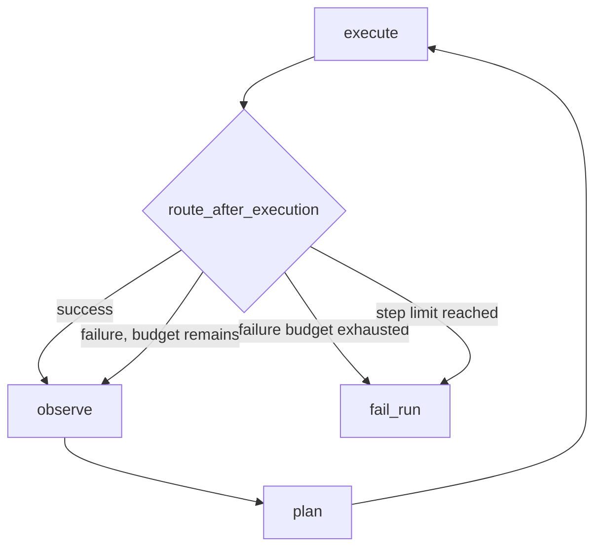

# Урок 17. Ограниченное восстановление после ошибки

## Проблема текущего графа

Сейчас после любой ошибки browser action:

```text
execute → fail_run → END
```

Например, planner выбрал кнопку:

```python
BrowserTarget(
    strategy="role",
    value="button",
    name="Primary",
)
```

Playwright нашёл её, но клик не сработал:

```text
Primary button is blocked
```

На странице при этом может присутствовать альтернативная кнопка. Planner уже
получает историю с ошибкой, но граф не даёт ему принять новое решение.

## Retry и replan — разные вещи

### Слепой retry

```text
click Primary
→ error
→ click Primary ещё раз
```

Такой повтор полезен только для действительно временных проблем. Он не меняет
решение и может бессмысленно повторять ошибку.

### Replan

```text
click Primary
→ error
→ observe page again
→ planner sees error history
→ click Alternative
```

Мы реализуем именно replan.

Новый маршрут:



## Почему после ошибки снова `observe`

Можно было направить:

```text
execute failure → plan
```

Но browser action иногда частично изменяет страницу перед ошибкой:

- открылось модальное окно;
- появился toast;
- началась навигация;
- элемент стал disabled;
- DOM обновился.

Planner должен принимать новое решение по свежему наблюдению:

```text
execute failure → observe → plan
```

## Откуда planner узнает об ошибке

Executor уже создаёт `ExecutionStep` даже при ошибке:

```python
ExecutionStep(
    action=...,
    result=ActionResult(
        success=False,
        error="Primary button is blocked",
    ),
)
```

Formatter памяти добавляет:

```text
Step 1
action=click
target=role=button[name="Primary"]
success=False
error=Primary button is blocked
```

После нового `observe` planner получает:

```text
execution history + current page snapshot
```

и может выбрать другой action.

## Почему recovery должен быть ограниченным

Без ограничений получится:

```text
error → replan → error → replan → ...
```

У нас уже есть:

```python
max_steps
```

Он ограничивает все действия. Но полезно иметь отдельный бюджет технических
ошибок:

```python
max_failures
```

Причины:

- пять успешных шагов и две ошибки не равны семи успешным шагам;
- отчёт должен знать количество неудачных попыток;
- можно быстро остановить нестабильный сценарий;
- policy становится явно настраиваемой в `TestCase`.

## Новое поле TestCase

```python
max_failures: int = Field(default=2, ge=1, le=20)
```

Значение `2` означает:

```text
первая ошибка → разрешить replan
вторая ошибка → завершить failed
```

Это число включает последнюю ошибку, после которой граф остановится.

## Новое поле AgentState

```python
failure_count: NotRequired[int]
```

`TestCase.max_failures` — конфигурация.

`AgentState.failure_count` — фактически использованное количество ошибок в
текущем запуске.

Это типичный паттерн:

```text
configuration limit + runtime counter
```

## Инициализация

Нода `initialize` должна добавить:

```python
"failure_count": 0
```

Важно инициализировать счётчик в одном месте, а не использовать повсюду:

```python
state.get("failure_count", 0)
```

Явный state contract делает граф понятнее.

## Обновление executor

После действия уже есть:

```python
result.success
```

Вычисли:

```python
next_failure_count = state["failure_count"]

if not result.success:
    next_failure_count += 1
```

Затем верни:

```python
{
    "last_result": result,
    "step_count": next_step_number,
    "failure_count": next_failure_count,
    "route": [...],
}
```

Мы считаем **общее количество failed actions**, а не только последовательные
ошибки. Успешное действие не сбрасывает счётчик.

## Почему failure всё равно записывается в route

Неудачная попытка является важным фактом:

- planner использует её для replanning;
- reporter объяснит маршрут;
- bug analyzer сможет отличить нестабильность UI;
- generated test не должен повторять нерабочий путь.

Поэтому:

```text
failed action увеличивает step_count
failed action увеличивает failure_count
failed action добавляется в route
```

## Порядок проверок router-а

После executor state уже содержит новые значения.

Рекомендуемый алгоритм:

```python
if state["step_count"] >= state["test_case"].max_steps:
    return "fail_run"

if state["last_result"].success:
    return "observe"

if state["failure_count"] >= state["test_case"].max_failures:
    return "fail_run"

return "observe"
```

Последний `observe` означает recovery.

Можно записать короче, но на учебном этапе явные ветки лучше показывают policy.

## Почему success идёт в observe

После успешного действия нам всё равно нужно новое состояние страницы:

```text
success → observe → plan
```

Поэтому и success, и recoverable failure возвращают `"observe"`, но по разным
причинам.

## Bounded autonomy

Агенту нельзя просто сказать:

```text
пробуй, пока не получится
```

Production agent должен иметь бюджеты:

- количество шагов;
- количество ошибок;
- время выполнения;
- количество LLM-вызовов;
- стоимость токенов;
- количество retries одного tool.

Это называется **bounded autonomy**: агент действует самостоятельно, но внутри
явных детерминированных ограничений.

LLM выбирает следующее действие. Обычный код решает, разрешено ли продолжать.

## Что считать багом

Ошибка действия ещё не обязательно означает product bug.

Возможные причины:

- planner выбрал неправильный элемент;
- страница изменилась;
- locator недостаточно точный;
- элемент временно перекрыт;
- это реальный дефект продукта;
- automation environment нестабилен.

Поэтому в этом уроке мы не создаём bug report сразу. Мы сохраняем evidence и
пытаемся найти рабочий маршрут.

Позже отдельный Failure Classifier решит:

```text
product bug / automation error / agent error / environment error
```

## Задание 17.1. Конфигурация failure budget

В `TestCase` добавь:

```python
max_failures: int = Field(default=2, ge=1, le=20)
```

Проверка:

```powershell
python -m pytest tests\test_recovery.py -k initialize -q
```

Этот тест также потребует следующий пункт.

## Задание 17.2. Инициализация счётчика

В `initialize()` добавь:

```python
"failure_count": 0
```

Проверка:

```powershell
python -m pytest tests\test_recovery.py -k initialize -q
```

## Задание 17.3. Подсчёт ошибок executor-ом

В `make_execute_node()`:

1. вычисли `next_failure_count`;
2. увеличь только при `result.success is False`;
3. верни поле `failure_count`.

Проверка:

```powershell
python -m pytest tests\test_recovery.py -k execute_node -q
```

## Задание 17.4. Recovery router

Измени `route_after_execution()`.

Поведение:

```text
success                             → observe
first failure, max_failures=2       → observe
second failure, max_failures=2      → fail_run
step_count reached max_steps        → fail_run
```

Проверка:

```powershell
python -m pytest tests\test_recovery.py -k route -q
```

## Задание 17.5. Полный recovery loop

После реализации:

```powershell
python -m pytest tests\test_recovery.py -q
```

Integration test симулирует:

```text
click Primary → failure
observe
planner sees error
click Alternative → success
observe
finish
judge
passed
```

## Полная проверка

```powershell
python -m pytest -q
```

Ожидается:

```text
64 passed
```

## Что важно понять

1. Чем replan отличается от слепого retry?
2. Почему после ошибки нужен новый observe?
3. Почему failed action остаётся в route?
4. Чем `max_steps` отличается от `max_failures`?
5. Кто выбирает альтернативное действие?
6. Кто решает, можно ли продолжать?
7. Почему первая техническая ошибка ещё не доказывает product bug?
8. Что означает bounded autonomy?
