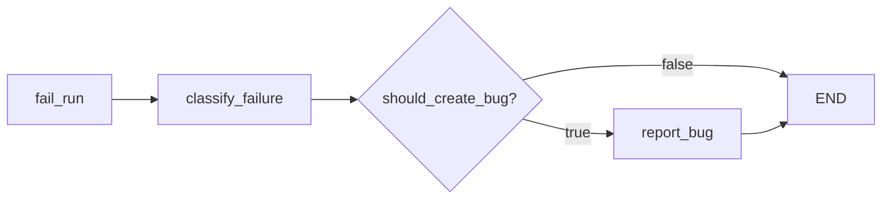

# Урок 20. Структурированный Bug Reporter

## Цель урока

Система уже умеет:

```text
выполнить тест-кейс
→ проверить expected через Judge
→ определить termination
→ классифицировать failed run
```

Теперь добавляем первый пользовательский артефакт:

```text
структурированный bug report
```

Новая failed-ветка:



## Разделение ответственности

### Failure Classifier

Отвечает:

```text
Что, вероятнее всего, стало причиной failed run?
Достаточно ли evidence для продуктового бага?
```

Результат:

```python
FailureClassification(
    category="product_bug",
    should_create_bug=True,
)
```

### Bug Reporter

Отвечает:

```text
Как оформить уже подтверждённую проблему в воспроизводимый отчёт?
```

Reporter не должен самостоятельно менять classification или решать, является
ли проблема багом.

Это важный архитектурный принцип:

```text
decision making отдельно
document generation отдельно
```

## Почему нельзя создавать баг для каждого failed run

Failed run может быть:

- ошибкой planner-а;
- проблемой locator-а;
- недоступным окружением;
- недостатком evidence;
- реальным дефектом продукта.

Если автоматически создавать баг для каждого падения, трекер быстро заполнится
ложными дефектами.

Поэтому reporter запускается только при:

```python
classification.should_create_bug is True
```

Pydantic classifier-а уже гарантирует, что это возможно только для:

```python
category == FailureCategory.PRODUCT_BUG
```

## Доменная модель бага

```python
class BugReport(BaseModel):
    test_case_id: str
    title: str
    severity: BugSeverity
    preconditions: list[str]
    steps_to_reproduce: list[str]
    expected_result: str
    actual_result: str
    evidence: list[str]
```

### `test_case_id`

Связь бага с исходным тест-кейсом.

### `title`

Коротко описывает:

```text
что сломано + при каком действии/условии
```

Хорошо:

```text
Task is not added after clicking Add
```

Плохо:

```text
Test failed
Something does not work
Bug on page
```

### `severity`

```python
class BugSeverity(StrEnum):
    BLOCKER = "blocker"
    CRITICAL = "critical"
    MAJOR = "major"
    MINOR = "minor"
```

Приблизительная policy:

```text
blocker  → система или тестируемый продукт полностью недоступен
critical → ключевой поток невозможен, потеря/повреждение данных
major    → функция работает неверно, но система доступна
minor    → низкое влияние, косметика или редкий edge case
```

Severity является оценкой влияния, а не уверенностью в существовании бага.

### `preconditions`

Состояние до воспроизведения:

```text
Tasks page is open
User is authenticated
Test data is available
```

Reporter не должен придумывать авторизацию или роли пользователя, которых нет
в test case и history.

### `steps_to_reproduce`

Список конкретных действий пользователя:

```text
1. Fill Task with Learn AI Agents
2. Click Add
```

Источник — `ExecutionStep.action`.

Reporter не должен включать:

- внутренние ноды LangGraph;
- вызовы LLM;
- технические `observe`;
- несуществующие действия;
- шаг `finish`.

### `expected_result`

Берётся из:

```python
test_case.expected
```

Reporter не формулирует новое требование.

### `actual_result`

Берётся из:

- final snapshot;
- Judge failed checks;
- action errors;
- classification evidence.

### `evidence`

Конкретные подтверждения:

```text
Final snapshot does not contain listitem "Learn AI Agents".
Judge marked expected result as failed.
Screenshot: artifacts/step-002.png.
```

В этом уроке screenshot paths присутствуют в route, но наш компактный formatter
их не передаёт. Reporter пока использует текстовое evidence. Позже добавим
отдельный artifact formatter.

## Валидация BugReport

Минимальный контракт:

```python
test_case_id: str = Field(min_length=1)
title: str = Field(min_length=5)
severity: BugSeverity
preconditions: list[str] = Field(min_length=1)
steps_to_reproduce: list[str] = Field(min_length=1)
expected_result: str = Field(min_length=1)
actual_result: str = Field(min_length=1)
evidence: list[str] = Field(min_length=1)
```

Почему списки не могут быть пустыми:

- без steps баг невоспроизводим;
- без evidence баг не подтверждён;
- без preconditions непонятна исходная точка.

## Reporter prompt

Reporter получает:

```text
Test case ID/name/start URL
Goal
Test data
Expected results
Termination
Failure classification
Judge verdict, если существует
Execution history
Final snapshot
```

System prompt запрещает придумывать отсутствующие факты.

Human prompt удобно организовать блоками:

```text
Test case:
...

Classification:
...

Termination:
...

Judge verdict:
...

Execution history:
...

Final page snapshot:
...
```

## Почему Reporter использует LLM

Маршрут хранится структурированно, но качественное оформление требует:

- объединить технические действия в пользовательские шаги;
- сформировать краткий title;
- сопоставить expected и actual;
- выбрать severity;
- убрать внутренний шум.

Здесь LLM действительно полезна как преобразователь evidence в документ.

Однако LLM не принимает решение о создании бага — это уже сделал classifier.

## Optional Judge verdict

Как и classifier, reporter может запускаться после:

```text
judge_failed
failure_limit
step_limit
```

Поэтому verdict может отсутствовать.

Используй:

```text
No Judge verdict is available.
```

когда `verdict is None`.

## Reporter chain

Знакомый LCEL-паттерн:

```python
prompt = build_reporter_prompt()
structured_model = model.with_structured_output(BugReport)
return prompt | structured_model
```

Четыре роли проекта:

```text
Planner    → BrowserAction
Judge      → JudgeVerdict
Classifier → FailureClassification
Reporter   → BugReport
```

## Reporter node

```python
def make_reporter_node(model):
    def report(state: AgentState) -> dict:
        bug_report = create_bug_report(...)
        return {"bug_report": bug_report}

    return report
```

Нода не меняет:

```text
status
termination
classification
```

Она добавляет новый артефакт.

## Router после classification

```python
def route_after_classification(state: AgentState) -> str:
    if state["classification"].should_create_bug:
        return "report_bug"
    return "end"
```

Router не проверяет category повторно: этот инвариант уже защищён моделью
`FailureClassification`.

## Почему маршрут `"end"`, а не имя ноды

`END` является специальным объектом LangGraph, а router обычно возвращает
простую строку.

Mapping:

```python
{
    "report_bug": "report_bug",
    "end": END,
}
```

Левая сторона — результат router-а.
Правая — реальная destination.

## Новая сигнатура builder

```python
def build_agent_graph(
    model,
    browser,
    judge_model=None,
    classifier_model=None,
    reporter_model=None,
):
```

Default:

```python
reporter_model = reporter_model or model
```

Пока одна Ollama-модель выполняет четыре роли. Архитектура уже позволяет
разделить их позднее.

## Задание 20.1. BugReport

В `models.py` реализуй:

```python
class BugReport(BaseModel):
    test_case_id: str = Field(min_length=1)
    title: str = Field(min_length=5)
    severity: BugSeverity
    preconditions: list[str] = Field(min_length=1)
    steps_to_reproduce: list[str] = Field(min_length=1)
    expected_result: str = Field(min_length=1)
    actual_result: str = Field(min_length=1)
    evidence: list[str] = Field(min_length=1)
```

Проверка:

```powershell
python -m pytest tests\test_bug_report_models.py -q
```

Ожидается:

```text
4 passed
```

## Задание 20.2. Prompt

В `reporter.py` реализуй `build_reporter_prompt()`.

Используй переменные:

```text
test_case_id
test_case_name
start_url
goal
test_data
expected
termination
classification
judge_verdict
execution_history
page_snapshot
```

## Задание 20.3. Chain

Реализуй `build_reporter_chain(model)`:

```python
model.with_structured_output(BugReport)
```

## Задание 20.4. Создание отчёта

В `create_bug_report()`:

1. построй execution history;
2. подготовь Judge verdict или сообщение об отсутствии;
3. передай classification через `model_dump()`, либо читаемую строку;
4. передай termination;
5. вызови chain.

Проверка должна увидеть в prompt:

```text
test case id
expected result
product_bug
action=fill
```

## Задание 20.5. Node

`make_reporter_node()` читает:

```python
state["test_case"]
state["classification"]
state["termination"]
state["page_snapshot"]
state["route"]
state.get("verdict")
```

и возвращает:

```python
{"bug_report": bug_report}
```

Проверка заданий 20.2–20.5:

```powershell
python -m pytest tests\test_reporter.py -q
```

Ожидается:

```text
3 passed
```

## Задание 20.6. Router

В `graph.py` реализуй:

```python
def route_after_classification(state: AgentState) -> str:
```

Поведение:

```text
should_create_bug=True  → report_bug
should_create_bug=False → end
```

## Задание 20.7. Интеграция графа

1. Импортируй `make_reporter_node`.
2. Добавь `reporter_model=None`.
3. Добавь default на основную модель.
4. Зарегистрируй `report_bug`.
5. Удали прямое ребро:

```python
classify_failure → END
```

6. Добавь conditional edges:

```python
builder.add_conditional_edges(
    "classify_failure",
    route_after_classification,
    {
        "report_bug": "report_bug",
        "end": END,
    },
)
```

7. Добавь:

```python
builder.add_edge("report_bug", END)
```

Проверка:

```powershell
python -m pytest tests\test_reporter_graph.py -q
```

Ожидается:

```text
2 passed
```

## Полная проверка

```powershell
python -m pytest -q
```

Ожидается:

```text
86 passed
```

## Что будет дальше

Следующий урок соберёт единый `RunReport` и сохранит результат в JSON и
Markdown. Тогда bug report перестанет существовать только внутри `AgentState`
и станет настоящим файлом, который можно открыть или отправить в issue tracker.

## Вопросы для самопроверки

1. Почему Reporter не должен решать, является ли проблема багом?
2. Почему не каждый failed run создаёт bug report?
3. Откуда должны браться steps to reproduce?
4. Чем expected result отличается от actual result?
5. Почему evidence обязательно?
6. Зачем severity отделена от confidence?
7. Почему reporter добавляет артефакт, но не меняет status?
