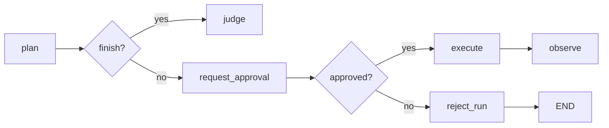

# Урок 24. Human-in-the-loop: interrupt и resume

## Цель

До этого агент либо выполнял действие автоматически, либо завершался из-за
ошибки. Теперь добавим третье состояние:

```text
агент предложил действие
→ граф остановился
→ человек изучил действие
→ человек одобрил или отклонил
→ граф продолжился с того же thread
```

Новая ветка:



## Human-in-the-loop не означает «человек внутри LLM»

Человек не становится новой моделью и не вызывается через prompt. LangGraph
останавливает workflow и возвращает наружу данные для review.

```text
LLM Planner -> proposed_action
LangGraph interrupt -> pause
UI/CLI/API -> получает решение человека
Command(resume=...) -> продолжает graph
```

В production решение может прийти из:

- консоли;
- web-интерфейса;
- Slack;
- Telegram;
- системы задач;
- отдельного approval API.

Граф не должен знать, каким UI воспользовался человек.

## Как работает interrupt

Внутри ноды:

```python
decision = interrupt({
    "question": "Approve this browser action?",
    "action": ...,
})
```

### Первый проход

`interrupt()` не возвращает обычное значение:

1. LangGraph сохраняет checkpoint.
2. Выполнение останавливается.
3. Payload становится доступен вызывающему коду.
4. Следующие ноды не запускаются.

При `graph.invoke()` payload находится в:

```python
result["__interrupt__"]
```

### Resume

Внешний код вызывает:

```python
graph.invoke(
    Command(
        resume={
            "approved": True,
            "reason": "Reviewed by operator.",
        }
    ),
    config=same_config,
)
```

Resume value становится результатом вызова `interrupt()`:

```python
decision = {
    "approved": True,
    "reason": "Reviewed by operator.",
}
```

Нода заканчивается и граф идёт дальше.

## Критически важное правило: нода начинается заново

После resume LangGraph повторно запускает ноду с начала:

```python
def approval_node(state):
    print("runs again after resume")
    decision = interrupt(...)
    return {"decision": decision}
```

Поэтому нельзя делать необратимый side effect перед interrupt:

```python
def bad_node(state):
    browser.click(...)       # выполнится до паузы
    decision = interrupt(...) # после resume нода начнётся заново
```

Клик может выполниться повторно.

Правильная архитектура:

```text
request_approval -> только формирует payload и останавливается
execute          -> выполняет browser action после approval
```

Approval-нода должна быть чистой до `interrupt()`.

## Почему нужен checkpointing

Interrupt не может существовать без сохранённого состояния:

```text
пауза
→ Python возвращает управление вызывающему коду
→ позже приходит решение
→ нужно знать state и следующую ноду
```

Поэтому обязательны:

```python
checkpointer = InMemorySaver()
thread_id = "approval-run-42"
```

И при resume нужно использовать:

- тот же compiled graph или graph с тем же checkpointer;
- тот же checkpointer;
- тот же `thread_id`.

Новый `thread_id` создаст новую пустую историю и не найдёт interrupt.

## Контракт решения человека

В `models.py` реализуй:

```python
class ActionApproval(BaseModel):
    approved: bool
    reason: str = Field(min_length=1)

    @field_validator("reason")
    @classmethod
    def reason_must_not_be_blank(cls, value: str) -> str:
        if not value.strip():
            raise ValueError("reason must not be blank")
        return value
```

Почему причина обязательна:

- появляется audit trail;
- понятно, почему действие было отклонено;
- решение можно анализировать;
- rejected run получает осмысленную termination message.

`min_length=1` не отклоняет строку `"   "`, поэтому нужен отдельный validator.

### Задание 24.1

Реализуй `ActionApproval`.

Проверка:

```powershell
python -m pytest tests\test_approval_models.py -q --basetemp=.pytest-tmp
```

Ожидается `3 passed`.

## Interrupt payload

Payload должен быть JSON-serializable, потому что он может пройти через сеть и
сохраниться в persistence backend.

Пример:

```python
{
    "type": "browser_action_approval",
    "step_number": 3,
    "action": {
        "action": "click",
        "target": {
            "strategy": "role",
            "value": "button",
            "name": "Delete account",
        },
        "value": None,
        "reason": "...",
    },
    "page_snapshot": "...",
}
```

Используй:

```python
state["proposed_action"].model_dump(mode="json")
```

`mode="json"` преобразует enum и вложенные модели в JSON-совместимые значения.

### Задание 24.2

Реализуй `build_approval_payload()` в `approval.py`:

```python
return {
    "type": "browser_action_approval",
    "step_number": state["step_count"] + 1,
    "action": state["proposed_action"].model_dump(mode="json"),
    "page_snapshot": state["page_snapshot"],
}
```

## Approval node

Добавь импорт:

```python
from langgraph.types import interrupt
```

Реализуй:

```python
def request_action_approval(state: AgentState) -> dict:
    resume_value = interrupt(build_approval_payload(state))
    decision = ActionApproval.model_validate(resume_value)
    return {"action_approval": decision}
```

Зачем `model_validate`: внешний ввод нельзя считать корректным. CLI, frontend
или API могут передать пропущенное поле или неверный тип.

### Задание 24.3

Реализуй approval node.

## Router

```python
def route_after_approval(state: AgentState) -> str:
    if state["action_approval"].approved:
        return "execute"
    return "reject_run"
```

Router не вызывает браузер и не меняет state. Он только выбирает ветку.

### Задание 24.4

Реализуй router.

## Rejected run

Добавь в `TerminationKind`:

```python
HUMAN_REJECTED = "human_rejected"
```

`reject_run`:

```python
def reject_run(state: AgentState) -> dict:
    return {
        "status": "failed",
        "termination": RunTermination(
            kind=TerminationKind.HUMAN_REJECTED,
            message=state["action_approval"].reason,
        ),
    }
```

Мы не отправляем rejected run в Failure Classifier. Отказ человека не является
доказательством продуктового бага.

### Задание 24.5

Реализуй termination kind и `reject_run()`.

Проверка заданий 24.2-24.5:

```powershell
python -m pytest tests\test_approval.py -q --basetemp=.pytest-tmp
```

Ожидается `4 passed`.

## Опциональная интеграция графа

Расширь builder:

```python
def build_agent_graph(
    ...,
    checkpointer=None,
    require_approval: bool = False,
):
```

Если `require_approval=True`, зарегистрируй:

```python
builder.add_node("request_approval", request_action_approval)
builder.add_node("reject_run", reject_run)
```

У `plan` уже есть router, который возвращает `"judge"` или `"execute"`.
Нам не нужно переписывать router. Меняется destination mapping:

```python
execute_destination = (
    "request_approval"
    if require_approval
    else "execute"
)

builder.add_conditional_edges(
    "plan",
    route_planned_action,
    {
        "judge": "judge",
        "execute": execute_destination,
    },
)
```

Обрати внимание:

```text
ключ "execute" -> значение router-а
destination     -> request_approval или execute
```

Для approval-режима добавь:

```python
builder.add_conditional_edges(
    "request_approval",
    route_after_approval,
    {
        "execute": "execute",
        "reject_run": "reject_run",
    },
)
builder.add_edge("reject_run", END)
```

При `require_approval=False` approval-ноды можно не регистрировать вообще.

### Задание 24.6

Интегрируй approval в `graph.py`.

Проверка:

```powershell
python -m pytest tests\test_approval_graph.py -q --basetemp=.pytest-tmp
```

Ожидается `3 passed`.

## Что показывают интеграционные тесты

Первый вызов:

```python
paused = graph.invoke(
    {"test_case": test_case},
    config=config,
)
```

Проверяет:

```text
interrupt существует
browser.click ещё не вызван
```

Approve:

```python
result = graph.invoke(
    Command(
        resume={
            "approved": True,
            "reason": "Action reviewed.",
        }
    ),
    config=config,
)
```

После resume выполняется `execute`.

Reject использует тот же механизм, но идёт в `reject_run`, не вызывая browser.

## Задание 24.7. Интерактивный реальный запуск

Не изменяй обычный `run_agent()` — он рассчитан на непрерывный автономный run.
Создай отдельный скрипт:

```text
scripts/run_agent_with_approval.py
```

Начальная схема:

```python
graph = build_agent_graph(
    model,
    browser,
    checkpointer=checkpointer,
    require_approval=True,
)
config = build_thread_config(test_case, thread_id)

current_input = {"test_case": test_case}

while True:
    result = graph.invoke(current_input, config=config)

    interrupts = result.get("__interrupt__", ())
    if not interrupts:
        final_state = result
        break

    payload = interrupts[0].value
    print(payload)

    answer = input("Approve action? [y/n]: ").strip().lower()
    reason = input("Reason: ").strip()

    current_input = Command(
        resume={
            "approved": answer == "y",
            "reason": reason,
        }
    )
```

Почему цикл: после approve агент может предложить следующее действие, которое
также вызовет новый interrupt.

## Почему пока подтверждаем каждое действие

Это учебная политика, а не production-решение. Она позволяет увидеть несколько
pause/resume в одном thread.

Позже добавим risk policy:

```text
assert_text -> автоматически
fill обычного поля -> автоматически
click submit/delete/pay -> approval
действие на неизвестном домене -> approval
низкая confidence -> approval
```

Human-in-the-loop должен уменьшать риск, а не превращать автоматизацию в ручное
тестирование.

## Полная проверка

```powershell
python -m pytest -q --basetemp=.pytest-tmp
```

Ожидается:

```text
116 passed
```

## Вопросы для самопроверки

1. Почему interrupt требует checkpointer и thread ID?
2. Что происходит при первом вызове `interrupt()`?
3. Что становится return value interrupt после resume?
4. Почему approval node запускается с начала?
5. Почему browser action должен находиться после approval node?
6. Почему resume требует тот же `thread_id`?
7. Почему rejection не отправляется в Failure Classifier?
8. Чем human-in-the-loop отличается от LLM Judge?

## Следующий урок

В уроке 25 сделаем policy-based approval: человек будет подключаться только к
рискованным действиям, а решение policy будет детерминированным и тестируемым.
