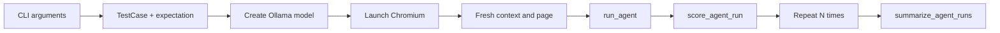

# Урок 30. Live end-to-end evaluation

## Цель

В уроке 29 мы проверяли настоящий граф, но заменяли внешние зависимости:

```text
deterministic model -> настоящий LangGraph -> fake browser
```

Такой тест отвечает:

> Правильно ли работает оркестрация, если модель принимает ожидаемые решения?

Теперь проверим всю систему в живом режиме:

```text
Ollama -> настоящий LangGraph -> Playwright -> Chromium -> HTML fixture
```

Live evaluation отвечает на другой вопрос:

> Насколько часто настоящая модель действительно доводит тест-кейс до ожидаемого
> результата в настоящем браузере?

## Почему одного запуска недостаточно

LLM является вероятностным компонентом. Даже при `temperature=0` результат может
изменяться из-за версии модели, реализации inference, изменений prompt, контекста
и structured output.

Один успешный запуск показывает только:

```text
система смогла пройти сценарий хотя бы один раз
```

Он не показывает:

```text
система стабильно проходит сценарий
```

Поэтому один test case запускается несколько раз:

```text
run 1 -> passed
run 2 -> passed
run 3 -> failed
run 4 -> passed
run 5 -> passed

exact accuracy = 4 / 5 = 0.8
```

## Что мы измеряем

Для каждого запуска используем `score_agent_run()` из урока 29:

- совпал ли итоговый status;
- совпала ли причина завершения;
- уложился ли агент в step budget;
- совпало ли ожидание recovery;
- выполнены ли все условия exact match.

После всех повторов `summarize_agent_runs()` вычисляет общие метрики.

Важно: `status=passed` ещё не означает `exact_match=True`. Агент может достичь цели,
но потратить слишком много шагов.

## Изоляция запусков

Каждый повтор должен получить новый:

- browser context;
- page;
- `PlaywrightBrowser`;
- каталог артефактов.

Нельзя использовать одну страницу для пяти повторов. После первого запуска задача
уже останется в DOM, и второй запуск начнётся не с исходного состояния.

Правильная граница:

```python
for run_number in range(1, repeat + 1):
    context = chromium.new_context()
    page = context.new_page()
    try:
        # one complete agent run
    finally:
        context.close()
```

`finally` гарантирует закрытие context даже при исключении.

## Controlled fixture и внешний сайт

В этом уроке используется:

```text
examples/playwright_fixture.html
```

Это настоящий HTML, открытый настоящим Chromium. Он отличается от fake browser:
Playwright реально ищет элементы, вводит текст и нажимает кнопку.

Но fixture контролируется нами. Внешний сайт пока не используем, потому что он
может измениться, стать недоступным или показать CAPTCHA. Сначала измеряем модель
в стабильной среде.

## Два разных вида ошибок

### Агент завершился со status failed

Это нормальный результат эксперимента:

```python
final_state = run_agent(...)
score = score_agent_run(expected, final_state)
```

Такой запуск должен попасть в метрики.

### Python/infrastructure exception

Например:

- Ollama недоступна;
- Chromium не установлен;
- structured output не удалось распарсить;
- Playwright завершился аварийно.

Это ошибка самого evaluation harness. На первом этапе её нужно напечатать вместе
с номером запуска и продолжить следующие повторы. Не подменяй infrastructure error
искусственным `status="failed"`: это разные типы результата.

## Структура скрипта

Работа выполняется в:

```text
scripts/evaluate_live_end_to_end.py
```

Поток данных:



## Задание 30.1. Создай live case

Реализуй `build_live_case()`:

1. Построй `file://` URL для `examples/playwright_fixture.html`.
2. Создай `TestCase`:

```python
id="live-create-task"
name="Create a task in the Playwright fixture"
goal="Add the task 'Learn AI Agents' to the task list"
test_data={"task": "Learn AI Agents"}
expected=["Learn AI Agents is visible in the task list"]
max_steps=5
max_failures=2
```

3. Создай ожидание полного запуска:

```python
status="passed"
max_steps=2
termination_kind=TerminationKind.JUDGE_PASSED
expects_recovery=False
```

4. Верни `EndToEndEvaluationCase`.

Почему два разных `max_steps`:

- `TestCase.max_steps=5` ограничивает выполнение графа;
- `EndToEndExpectation.max_steps=2` определяет желаемое качество маршрута.

Графу разрешено сделать до пяти действий, но хороший маршрут должен уложиться в два.

## Задание 30.2. Реализуй один запуск

Реализуй `run_once()`:

1. Создай новый browser context.
2. Создай новую page.
3. Оберни page в `PlaywrightBrowser`.
4. Используй каталог:

```text
artifacts/live-evaluation/run-001
artifacts/live-evaluation/run-002
...
```

5. Вызови `run_agent()`.
6. Передай итоговый state в `score_agent_run()`.
7. Верни `(final_state, score)`.
8. Закрой context через `finally`.

Не создавай модель внутри `run_once()`. Одна загруженная модель может обслужить
все повторы. Состояние сайта при этом обязано быть новым.

## Задание 30.3. Реализуй цикл эксперимента

В `main()`:

1. Прочитай `--repeat`, `--headless` и `--slow-mo`.
2. Создай `ChatOllama` с моделью из `OLLAMA_MODEL`.
3. Один раз запусти Chromium.
4. Выполни `run_once()` нужное количество раз.
5. После каждого запуска напечатай:

```text
run=1 status=passed steps=2 failures=0 exact=True
```

6. Собери результаты в список.
7. В конце вызови `summarize_agent_runs(scores)`.
8. Напечатай summary как JSON.

Параметр `--repeat` должен быть не меньше 1.

## Задание 30.4. Обработка исключений

Оберни отдельный повтор в `try/except`, чтобы ошибка одного запуска не скрыла
результаты предыдущих запусков.

Формат:

```text
run=2 infrastructure_error=...
```

После цикла:

- если нет ни одного `score`, заверши программу понятной ошибкой;
- если часть запусков упала инфраструктурно, отдельно напечатай их количество;
- не включай infrastructure errors в знаменатель agent accuracy.

Последний пункт является осознанным решением текущего урока. В production dashboard
мы будем показывать две независимые метрики:

```text
agent exact accuracy
infrastructure success rate
```

## Запуск

Сначала Ollama:

```powershell
ollama serve
```

В другом терминале:

```powershell
$env:OLLAMA_MODEL="qwen3.5:35b"
python scripts\evaluate_live_end_to_end.py --repeat 3
```

Видимый браузер с замедлением:

```powershell
python scripts\evaluate_live_end_to_end.py --repeat 3 --slow-mo 300
```

Headless-режим:

```powershell
python scripts\evaluate_live_end_to_end.py --repeat 5 --headless
```

## Критерии завершения

1. Каждый повтор начинается с чистой HTML-страницы.
2. Используются настоящие Ollama, Playwright и LangGraph.
3. Для оценки переиспользуется scorer урока 29.
4. Артефакты повторов не перезаписывают друг друга.
5. Ошибка одного повтора не ломает весь эксперимент.
6. В консоли есть результаты отдельных runs и общий summary.
7. Обычный `pytest` по-прежнему проходит.

Мы не требуем `exact_accuracy=1.0`: это измеряемая характеристика модели, а не
условие правильности Python-кода.

## Вопросы для самопроверки

1. Почему live evaluation не заменяет deterministic evaluation?
2. Почему для каждого повтора нужен новый browser context?
3. Чем `TestCase.max_steps` отличается от evaluation step budget?
4. Почему `temperature=0` не превращает LLM в обычную детерминированную функцию?
5. Почему infrastructure error нельзя считать обычным провалом агента?
6. Почему scorer не должен знать, используется fake browser или Playwright?
7. Что означает `exact_accuracy=0.8` при пяти повторах?

